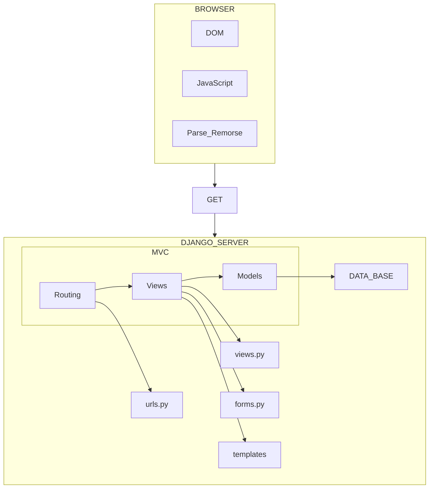

# ABOUT THE COURSES

https://online.dr-chuck.com/     
Github https://github.com/csev
https://github.com/csev/dj4e-samples/

* DJANGO Foe Everybody
   ```py
   course     # https://www.dj4e.com/lessons/      lessons has discussion when logued in
              # https://www.dj4e.com/lectures/    https://samples.dj4e.com/
            
   asignament # https://www.dj4e.com/assn/
   homework   # https://www.dj4e.com/assignments
   Tools      # https://www.dj4e.com/tsugi/store/
              # https://www.dj4e.com/mod/
    
   
   playlist   # https://www.youtube.com/playlist?list=PLlRFEj9H3Oj5e-EH0t3kXrcdygrL9-u-Z
   video      # https://www.youtube.com/watch?v=o0XbHvKxw7Y  <-- CODE_CAMP  
   Github # https://github.com/csev/dj4e-samples
          # https://github.com/tsugitools

   ```
   
* PYTHON Foe Everybody
```py
   course #  https://www.pg4e.com/lessons/
   videos #  https://www.youtube.com/playlist?list=PLlRFEj9H3Oj7Bp8-DfGpfAfDBiblRfl5p
```
* POSGRESS Foe Everybody
```py
   course   # https://www.pg4e.com/lessons/
   playlist # https://www.youtube.com/playlist?list=PLlRFEj9H3Oj7Oj3ndXmNS1FFOUyQP-gEa
```
```py
WEB APP # https://www.wa4e.com/lessons
C & C++ # https://www.cc4e.com/lessons
```

# 2 Request/Response Cycle
00:07:04 

 1. User clicks on a HTML tag href='value' 
    `<a href="http://www...">` + click.event

 2. Browser opens a Network socket to the server
    Makes HTTP GET URL request for server HTML page at URL

 3. Sesver searches HTML corresponding to URL

 4. The server makes HTTP response and Browser shows the HTML

 #### MY NETWORKS BOOK 
 https://www.net-intro.com/

 #### MY COURSES 
 https://www.py4e.com/lessons. . .   https://www.dj4e.com/lessons
   DOCS                             https://docs.djangoproject.com/en/4.2/ref/


# 3 Exploring the HyperText Transfer Protocol HTTP 
00:13:07

   HTTP reequest examples :
   
   http://localhost:8080/friendships/create?my_id=100&user_id=200

   http://www.domain-name.org/home_page.html


* HAS 4 SECCIONS 
   ```c
   protovol :  "http://"                          "http://"
   host     :  "localhost:8080"                   "www.domain_name.org"
   document :  "/friendships/create"              "/home_page.html"
   querry   :  "?my_id=100&user_id=200"   
   ```
`

HTTP : 1989 CERN Tim Berners-Lee for automated information-sharing
https://cds.cern.ch/images/OPEN-PHO-CCC-2019-001-1
 
WWW  2 protocols groups :   HTTP . & . email : (SMTP,POP,IMAP)

standard RFCs Request For Comments  https://www.ietf.org/standards/rfcs/
Internet Protocols       https://www.rfc-editor.org/rfc/   pulic & royalty free 
 
HTTP_1.1  RFC2616  Chap 5 Request

connect server port 80 or 443

client request : GET "http://www.facebook.con" HTTP/1.0

console telnet remooved from OS couse !encripted conection
 
```sh
apt-install telnet

  telnet data.pr4e.org 80

> Trying 192.241.136.170...
> Connected to data.pr4e.org.
> Escape character is '^`]`'.
   `a`                                          # WE SEBD REQUEST
> HTTP/1.1 400 Bad Request                      # OUR REQUEST = BAD
> Content-Length: 308
> Connection: close
> Content-Type: text/html; charset=iso-8859-1   # TELLING US PROTOCOL
`GET http://data.pr4e.org/page1.htm HTTP/1.0`   # WE CORRECT IT  
> HTTP/1.1 200 OK
> Date: Thu, 04 Jan 2018 14:45:10 GMT 
> Server: Apache/2.4.7 (Ubuntu)
> Last-Modified: Mon, 15 May 2017 11:11:47 
>
> GMT Content-Type: text/html  #  HTTP, GMT = UTC (Coordinated Universal Time).
> <h1>The First Page</h1>
> <p>If you like, you can switch to 
> the <a href="http://www.dr-chuck.com/page2.htm">Sec
> Page</a>.</p>
> Connection closed by foreign host.
```

200 is a  HTTP STATUS CODE  https://en.wikipedia.org/wiki/List_of_HTTP_status_codes
. . . . . . . . . . . . . . . . . https://developer.mozilla.org/en-US/docs/Web/HTTP/Status
HTTP Memes :    https://http.cat/ . https://httpstatusdogs.com/ . https://imgur.com/gallery/4KqWq 
```
1xx info          100 Continue   102 Processing
2xx success       200 ok   202 Accepted   
3xx redirection   300 Multiple-Choices 302 Found  301 Moved-Permanently     307 Temporary-Redirect
4xx client errors 400 Bad-Request  403 Forbidden  404 Not-Found  407 Proxy-Authentication Required  409-Conflict 410 Gone
5xx server errors 500 Internal-Server-Error   503 Service-Unavailable
```

# 4 Using Sockets to Make Network Connections in Python
00:29:35

 https://en.wikipedia.org/wiki/Network_socket

an endpoint of bidirectional inter-process communication flow
across Iinernet Protocol IP-based computer Netwoek

#### IP (devide adress)
IPV4  xxx.xxx.xxx.xxx  . . .  .xxx -> 0...255
IPV6  xxx.xxx.xxx.xxx  . . .  .xxx -> 0...255

#### TCP PORT (process adress)
25 r-mail 23 login 80 WebServer 443 WebServer
109 & 110  Personal Mail box


# 5 Building a Simple Web Browser in Python
00:36:08

https://www.dj4e.com/code/http/socket1.py

```py
import socket
mysock = socket.socket(socket.AF_INET, socket.SOCK_STREAM) # make soket
mysock.connect(('data.pr4e.org', 80))     # connect port 80 to my course
cmd = 'GET http://data.pr4e.org/page1.htm HTTP/1.0\r\n\r\n'.encode() # request +two enter
mysock.send (cmd)                         # send request

while True:                         # Blocking line
    data = mysock.recv(512)         # store 512 caractersdata
    if len(data) < 1:#              # END ? 
       break 
    print(data.decode(), end='')    # decode (http UTF-8 -> Python unicode )
    
mysock.close()                      # close our end
" Unicode uses a fixed character set," 
"while UTF-8 uses variable length."
"This means that UTF-8 can represent more than one character at a time , while Unicode just 1 "
```
Browser + Dev Mode F12


```sh
HTTP/1.1 200 OK
Date: Sun, 01 Oct 2023 02:13:17 GMT
Server: Apache/2.4.18 (Ubuntu)
Last-Modified: Mon, 15 May 2017 11:11:47 GMT
ETag: "80-54f8e1f004857"
Accept-Ranges: bytes
Content-Length: 128
Cache-Control: max-age=0, no-cache, no-store, must-revalidate
Pragma: no-cache
Expires: Wed, 11 Jan 1984 05:00:00 GMT
Connection: close
Content-Type: text/html

<h1>The First Page</h1>
If you like, you can switch to the 
<a href="http://data.pr4e.org/page2.htm">
Second Page</a>.
```


00:44:47 

# 6 Building a Simple HTTP Server in Python


https://www.dj4e.com/code/http/server.py

   ```py
   # https://docs.python.org/3/howto/sockets.html
   # https://stackoverflow.com/questions/8627986/how-to-keep-a-socket-open-until-client-closes-it
   # https://stackoverflow.com/questions/10091271/how-can-i-implement-a-simple-web-server-using-python-without-using-any-libraries

   from socket import *

   def createServer():
      serversocket = socket(AF_INET, SOCK_STREAM)
      try :
         serversocket.bind(('localhost',9000))
         serversocket.listen(5) # Queue the incoming connections to 5 if bussy
         while(1):
               (clientsocket, address) = serversocket.accept()

               rd = clientsocket.recv(5000).decode()   # decode Revived
               pieces = rd.split("\n")
               if ( len(pieces) > 0 ) : print(pieces[0]) # we could check but dont

               data = "HTTP/1.1 200 OK\r\n"     # send same html regardles HTTP
               data += "Content-Type: text/html; charset=utf-8\r\n"
               data += "\r\n"
               data += "<html><body>Hello World</body></html>\r\n\r\n"
               clientsocket.sendall(data.encode())
               clientsocket.shutdown(SHUT_WR)

      except KeyboardInterrupt :
         print("\nShutting down...\n");
      except Exception as exc :
         print("Error:\n");          #  [Errno 98] Address already in use
         print(exc)

      serversocket.close()

                                 # main
   print('Access http://localhost:9000') # ask user to connect
   createServer()                        # start server
   ```
cant use the same port with 2 aplications if you run it twice it will crash
thats why  `try:`  if the port was not closed we get [Errno 98] Address already in use

 #### Client

https://www.dj4e.com/code/http/client1.py

```py
   import socket

   mysock = socket.socket(socket.AF_INET, socket.SOCK_STREAM)
   mysock.connect(('127.0.0.1', 9000))  # 
   cmd = 'GET http://127.0.0.1/romeo.txt HTTP/1.0\r\n\r\n'.encode()
   mysock.send(cmd)

   while True:
      data = mysock.recv(512)
      if len(data) < 1:
         break
      print(data.decode(),end='')

   mysock.close()
```

running  server.py :

```sh
Access http://localhost:9000  # 1 connection     '' = rooth directory
> GET / HTTP/1.1              # Browser :  GET     ''         HTTP1.1
> GET /favicon.ico HTTP/1.1   #            GET '/favicon.ico' HTTP1.1
> GET / HTTP/1.1              # 2 connect
> GET /favicon.ico HTTP/1.1   # 3 connect ..... never disconect (we SERVER)
```


00:60:00

   A single request client :
https://www.dj4e.com/code/http/client2.py  Must have a `romero.txt` in our server 
```py
import urllib.request

fhand = urllib.request.urlopen('http://127.0.0.1:9000/romeo.txt')
for line in fhand:
    print(line.decode().strip())
```
server output:
```sh
Access http://localhost:9000
GET /romeo.txt HTTP/1.1
```

changing the server print metod
```py
   pieces = rd.split(" ")
   if ( len(pieces) > 0 ):
         for word in pieces :
            print(word)
```
we get the full request
```sh
Access http://localhost:9000
GET
/romeo.txt
HTTP/1.1
Accept-Encoding:
identity
Host:
127.0.0.1:3000
User-Agent:
Python-urllib/3.10
Connection:
close
```
this was the full HTTP  for the single request client
https://docs.python.org/3/howto/sockets.html
https://docs.python.org/3/howto/urllib2.html

# 7Understanding Browser Developer Mode
01:00:53 

   https://www.dr-chuck.com/page1.htm + F12

## inspect
We can inspect and change HTMP elements but server wont notice the change

  
### network: 

   https://www.dr-chuck.com/page1.htm :
```
       method status Protocol  Type     
page1.htm GET  200      h2   document            (double-ckick )->  *OPEN*
755.js    GET  200      OK   chrome-extension	script . main.js:2
995.js    GET  200      OK   chrome-extension	script	main.js:2
```
   https://www.dr-chuck.com/nopage.htm  nopage.htm . GET . . 404 . h2 . Document
```
page1.html:
General: Request URL:https://www.dr-chuck.com/page1.htm
. . . . .Request Method: GET
. . . . .Status Code:    200 . . . . . . . . . . `OK`
. . . . .Remote Address:   74.208.236.248:443    `PORT:443`
. . . . .Response Headres():

Response Headers(6):
. . . . .Content-Encoding: gzip
. . . . .Content-Type: text/html

Accept Headers(20):
. . . . .Accept: text/html,application/xhtml+xml,application/xml;q=0.9,image/avif,image/we
. . . . .image/apng,*/*;q=0.8,application/signed-exchange;v=b3;q=0.7
```

  network botom bar : (similar to oerformance)

>  22 requests  480 kB transferred  1.3 MB resources  
> Finish: 964 ms  DOMContentLoaded: 722 ms   Load: 972 ms
 
 shows us a list of the requests
```
tsugiscripts_head.js          static.tsugi.org/js
bootstrap.min.css             static.tsugi.org/bootstrap-3.4.1/css
jquery-ui.min.css             static.tsugi.org/js/jquery-ui-1.11.4
all.css                       static.tsugi.org/fontawesome-free-5.8.2-web/css
v4-shims.css                  static.tsugi.org/fontawesome-free-5.8.2-web/css
tsugi2.css                    static.tsugi.org/css
theme-customizations.css      static.tsugi.org/css
```


## performance

> performance     Range: 174 ms – 1.01 s   
>   29 ms  Loadinng  130 ms  Scripting  76 ms  Rendering 8 ms  Painting155 ms  System  438 ms  Idle     836 ms  Total
>  shows us a timeline of the requests  


`DOM loader `  slowest request  `Warning:` Long task took 58.29 ms.     
https://web.dev/optimize-long-tasks/?utm_source=devtools

# 8 The Structure of a Django Application
01:10:35 
```
REQUEST FLOW ROUTING :  MVC Web Pattern

   MODEL       describes the structure of database
   VIEW        handles database acces/store data (model)
   CONTROLER   user interaction logic ?
```
 

PROJECT_DIR:

   * __init__.py    .
   * settings.py    . to inlude APPS 
   * urls.py        . rout every APP.URl to PROJ
   * wsgi.py        .
   * /APP_1  DIR :    
      - `__init__.py `(empty) : to tell python files are here 
      - `admin.py`. . .        
      - `apps.py` . . .         
      - /migrations . . .      DB
         * __init__.py    . 
      - models.py . . .       DB 
      - tests.py  . . .       
      - urls.py  . . .  rout every URL to an  APP fun()
      - views.py . . .  handle html to user   
      - forms.py




# 10 Installing Django on PythonAnywhere
01:17:39 
https://www.pythonanywhere.com/pricing/ ->Free Acount
ariellor-Ariel-PythonAnywhere-1
https://www.pythonanywhere.com/user/ariellor/


#### virtual enviropment

https://www.pythonanywhere.com/user/ariellor/consoles/
START A NEW CONSOLE : Other:	Bash 

23:46 ~ $ python3 --version
Python 3.10.5

We are ok ...  our python  > 3.8 compatible with any django
https://docs.djangoproject.com/en/4.2/faq/install/#what-python-version-can-i-use-with-django

https://www.dj4e.com/assn/dj4e_install.md
```
      I WILL USE LOCAL MACHINE
      python -> python3
      cd ~   -> cd /Django_18h
```

Setting Up Your Environment
```
mkvirtualenv django4 --python=/usr/bin/python3.9
pip install django==4.2.3
workon django4
```
### [Installing the Sample Code for DJ4E](https://www.dj4e.com/assn/dj4e_install.md#:~:text=Installing%20the%20Sample%20Code%20for%20DJ4E)

```
git clone https://github.com/csev/dj4e-samples
cd dj4e-samples
pip install -r requirements4.txt
python3 manage.py check
```

1:23:00

### Building Your Application

```sh
cd ..
mkdir django_projects
cd django_projects/
django-admin startproject mysite
```

### EDIT SETTINGS.py

1:25:00   ADD : '*'
https://www.pythonanywhere.com/user/ariellor/files/home/ariellor/django_projects/mysite/mysite/settings.py?edit
```py
ALLOWED_HOSTS = [ '*' ]
```
1:25:00 check
```sh
python3 manage.py check
```

1:27:00 SET PythonEverywhere  WEB APP
https://www.pythonanywhere.com/user/ariellor/webapps/#tab_id_new_webapp_tab
  edit the WGSI Configuration 
```py
import os
import sys

path = os.path.expanduser('~/django_projects/mysite')
if path not in sys.path:
    sys.path.insert(0, path)
os.environ['DJANGO_SETTINGS_MODULE'] = 'mysite.settings'
from django.core.wsgi import get_wsgi_application
from django.contrib.staticfiles.handlers import StaticFilesHandler
application = StaticFilesHandler(get_wsgi_application())
```
set Virtual Env

set WSGI as  Virtualenv: /home/ariel/.virtualenvs/django4

and edit the WSGI FILE
```py
import os
import sys

path = os.path.expanduser('~/django_projects/mysite')
if path not in sys.path:
    sys.path.insert(0, path)
os.environ['DJANGO_SETTINGS_MODULE'] = 'mysite.settings'
from django.core.wsgi import get_wsgi_application
from django.contrib.staticfiles.handlers import StaticFilesHandler
application = StaticFilesHandler(get_wsgi_application())
```


# 12 HTML - HyperText Markup Language (Part 1)
01:34:32 

   ```html
   <!-- COMMENT -->
   <!DOCTYPE html>
      <html lang="en">
         <head>
         <meta charset="UTF-8">   <!-- METADATA -->
         <title> tab name </title>
      </head>

      <body>
         DISPLAYABLE
      </body>
   </html>
   ```


# HTML - HyperText Markup Language (Part 2)
# Code Walk Through HTML
# CSS - Cascading Style Sheets - (Part 1)
# CSS - Cascading Style Sheets - (Part 2)
# CSS - Cascading Style Sheets - (Part 3)
# CSS - Sample Code Walkthrough (Part 1)
# CSS - Sample Code Walkthrough (Part 2)
# Using GitHub With Django and PythonAnywhere
# Using ngrok to Submit Assignments to DJ4E


# 22 How Databases Work

computers had small slow data in form of tape (not ram)
Banks had acounts money in a tape and updated the ones who had transaction in another tape
Then came the hardrive and research in how to best use it. interconected ? Tree SQL was invented 

SQL Sequential Querry Language
Lets abstract of where the data is on the disc 
And center on the operations we want to perform  :  

Write  Read    Update Delete  
Create Retreve Update Delete .... CRUD 

Srtuctured by levels   
 * external  (view)   :  user
 * conceptual(schema) : comunity (multiple users)
 * internal  (schema) : Physical

COMON EXAMPLES 
- Postgres – Open source, enterprise-scale, very tweakable
- Oracle - Large, commercial, enterprise-scale, very tweakable
- MySql - Simpler but very fast and scalable - commercial open source
- SqlServer - Very nice - from Microsoft (also Access)
- HSQL, SQLite, ...


# 23 Introduction to Structured Query Language (SQL)

## install SQLite
```sh
sudo apt install sqlite
sqlite
# SQLite version 2.8.17
# Enter ".help" for instructions
sqlite> .help
```
```sql
--.help                  Show this message
--.quit                  Exit this program
--.exit                  Exit this program
--.read   FILENAME       Execute SQL in FILENAME
--.tables ?PATTERN?      List names of tables matching a pattern
--.schema ?TABLE?        Show the CREATE statements
--.dump   ?TABLE? ...    Dump the database in a text format
--.databases             List names and files of attached databases
--.echo      ON|OFF      Turn command echo on or off
--.explain   ON|OFF      Turn output mode suitable for EXPLAIN on or off.
--.header(s) ON|OFF      Turn display of headers on or off
--.indices TABLE         Show names of all indices on TABLE
--.mode MODE             Set mode to one of "line(s)", "column(s)", 
-- ................                "insert", "list", or "html"
--..........................................
--.........................................continues..........
```
```sh
sqlite> .quit
All-Series:~$ sqlite3
```

## CREATE  TABLE

enter in sqlite3  to support AUTOINCREMENT

```sql
sqlite3
-- sqlite3 zip.sqlite3 -- SQLite version 3.37.0 

sqlite > .tables -- EMPTY
----------------------------------------
sqlite > CREATE TABLE Users( 
   ... >   id INTEGER NOT NULL 
   ... >       PRIMARY KEY AUTOINCREMENT,
   ... >   name VARCHAR(128), 
   ... >   email VARCHAR(128)
   ... > ) ;
```


COURSE USES NEWER VERION : 3.11
https://www.sqlite.org/download.html

## LOOK  TABLES

```sql
 .tables; ------ EMPTY 
 .quit; --------we need to create DB file
```

## CREATE FILE
```sh
All-Series:~$ sqlite3 mydatabase.db
```

CREATE TABLE Users.......... /// we repeat same


```sql
 .tables ------ see tables
--  Users  
 .schema Users --  see User schema :
------------------------------
--CREATE TABLE Users(
--  id INTEGER PRIMARY KEY,
--  name VARCHAR(128), 
--  email VARCHAR(128)
--);
```

## OVERVIEW SQLITE CRUD 

```sql   
CREATE TABLE Users(
   id INTEGER NOT NULL PRIMARY KEY AUTOINCREMENT,
  name VARCHAR(128),
  email VARCHAR(128)
) ;

INSERT INTO Users (name, email) VALUES ('Kristin', 'kf@umich.edu');

SELECT   FROM Users WHERE email='ted@umich.edu' ;   --    1|Kristin|kf@umich.edu
SELECT * FROM Users ORDER BY name DESC     ;        --    1|Kristin|kf@umich.edu

DELETE FROM Users WHERE email='ted@umich.edu' ;     --

UPDATE Users SET name='Charles' WHERE email='csev@umich.edu' ;
```


```sql
.mode column
CREATE TABLE "Users" (
    "id" INTEGER PRIMARY KEY AUTOINCREMENT NOT NULL UNIQUE, 
    "name" TEXT,
    "email" TEXT
);
.schema Users  -- see
INSERT INTO Users (name, email) VALUES ('Kristen', 'kf@umich.edu');
INSERT INTO Users (name, email) VALUES ('Chuck', 'csev@umich.edu');
INSERT INTO Users (name, email) VALUES ('Colleen', 'cvl@umich.edu');
INSERT INTO Users (name, email) VALUES ('Ted', 'ted@umich.edu');
INSERT INTO Users (name, email) VALUES ('Sally', 'a1@umich.edu');

SELECT * FROM Users;
DELETE FROM Users WHERE email='ted@umich.edu';
SELECT * FROM Users;
UPDATE Users SET name="Charles" WHERE email='csev@umich.edu';
SELECT * FROM Users;
SELECT * FROM Users WHERE email='csev@umich.edu';
SELECT * FROM Users ORDER BY email;
SELECT * FROM Users ORDER BY name DESC;
If you want: DROP TABLE Users; 
```

GUI for Linux 
DOCUMENTATION   https://github.com/sqlitebrowser/sqlitebrowser/wiki#basic-usage
DOWNLOAD
   LINUX:   https://sqlitebrowser.org/blog/linux-appimage-available/
    file -> propieties -> Permisions -> allow to run as program
   WINDOWS  https://sqlitebrowser.org/blog/version-3-12-2-released/

# 24 Demonstration: Basic SQL

# 25 Introduction to Django Models  

## ORM . ( Obj-Relat Mospping )

https://www.dj4e.com/lessons/dj4e_modules
```MERMAID
graph TD;      SQL_ORM --> MySQL   
   Python -->  SQL_ORM --> SQLite
               SQL_ORM --> Posgres   
             
   subgraph Python
      Model
      library 
      models.py
   end
```


#### Object Relational Mapping (ORM)

   Allows us to map objects to  tables
   We use those objects to store and retrieve data from the database
   allowing to use  (SQLite, MySQL, Postgres, Oracle)

Lest us perform SQL  CRUD  operations
 
create         read              update                delete
INSERT INTO    SELECT * FROM     UPDATE object  SET    DELETE FROM    

#### istead of Sqlite we are gonna use Django
```py
      MODELS.PY:    #   <---------------------- SQL:
from django.db import models #                     sqlite3   example.dB
class User(models.Model):    #    <------------ CREATE TABLE Users(
   name = models.CharField(max_length=128) #        name VARCHAR(128),
   email = models.CharField(max_length=128)#        email VARCHAR(128))  ;
```

### makemigrations
```sh
python3 manage.py makemigrations
# Migrations for 'users':
# users/migrations/0001_initial.py
# - Create model User
```
###migrate
```sh
python3 manage.py migrate
# Running migrations:
# Applying contenttypes.0001_initial... OK
# Applying sessions.000
```


## importing Django models
models.py:

```py
from django.db import models

class User(models.Model):
    name = models.CharField(max_length=128)
    email = models.CharField(max_length=128)
```
https://github.com/csev/dj4e-samples/tree/master/users


## migtations perform

```sh
 cd ~/dj4e-samples
 python3 manage.py makemigrations
# Migrations for 'users':
# users/migrations/0001_initial.py    >> Create model User

python3 manage.py migrate
# Running migrations:
# Applying contenttypes.0001_initial... OK  .....
# Applying sessions.0001_initial... OK
# Applying users.0001_initial... OK
```


## migtations result
   
```sh
$ cd ~/dj4e-samples
$ sqlite3 db.sqlite3
```
```sql
   sqlite> .tables
#   auth_group                  django_admin_log
#   [ ..snip ..]
#   auth_user                   django_session
#   auth_user_groups            users_user
#   auth_user_user_permissions

   sqlite> .schema users_user
   CREATE TABLE IF NOT EXISTS "users_user" (
      "id" integer NOT NULL PRIMARY KEY AUTOINCREMENT,
      "name" varchar(128) NOT NULL,
      "email" varchar(128) NOT NULL
   );
    sqlite> .quit
```

# 26 Demonstration: Django Single Table Models


####  Set manage.py for DB migration
database & opening 
```sh
# https://www.dj4e.com/lectures/DJ-02-Model-Single.txt
cd dj4e-samples
git pull                          # incase there are updates
pip install -r requirements4.txt  # to make sure that all the utilities are there

python3 manage.py check           # Make sure things are set up
python3 manage.py makemigrations  # Probably won't find any changes
rm db.sqlite3                     # In case you have done this before
python3 manage.py migrate         # Create the database and table(s)

Start the django shell:
python3 manage.py shell
```
#### python shell -> CRUD operations

manage.py


```py
# https://www.dj4e.com/lectures/DJ-02-Model-Single.txt
#                           (In the shell at the prompt) 
#store it in the database
In [1]: from users.models import User    # CREATE
In [2]: u = User(name='Kristen', email='kf@umich.edu')
In [3]: u.save()
In [4]: u.id
Out[4]: 1      # 1 element
In [5]: u = User(name='Chuck',   email='csev@umich.edu')
   ...: u.save() 
   ...: u = User(name='Colleen', email='cvl@umich.edu')
   ...: u.save()
   ...: u = User(name='Ted',     email='ted@umich.edu')
   ...: u.save()
   ...: u = User(name='Sally',   email='a2@umich.edu')
   ...: u.save()
In [6]: u.id
Out[6]: 5      # CREATED 5 elements

In [7]: User.objects.values()    # READ see all values
Out[7]: # <QuerySet  [
   #   {'id': 1, 'name': 'Kristen', 'email': 'kf@umich.edu'  },
   #   {'id': 2, 'name': 'Chuck',   'email': 'csev@umich.edu'},
   #   {'id': 3, 'name': 'Colleen', 'email': 'cvl@umich.edu' },
   #   {'id': 4, 'name': 'Ted',     'email': 'ted@umich.edu' }, 
   #   {'id': 5, 'name': 'Sally',   'email': 'a2@umich.edu'  }]>

In [10]: User.objects.filter(email='csev@umich.edu').values()
Out[10]: <QuerySet [{'id': 2, 'name': 'Charles', 'email': 'csev@umich.edu'}]>

                                          # DELETE
In [8]: User.objects.filter(email='ted@umich.edu').delete()
Out[8]: (1, {'users.User': 1})   # 

                                          # UPDATE
In [9]: User.objects.filter(email='csev@umich.edu').update(name='Charles')
Out[9]: 1

In [11]: User.objects.values().order_by('email') # READ
Out[11]: # <QuerySet [
   #   {'id': 5, 'name': 'Sally',   'email': 'a2@umich.edu'  },
   #   {'id': 2, 'name': 'Charles', 'email': 'csev@umich.edu'},
   #   {'id': 3, 'name': 'Colleen', 'email': 'cvl@umich.edu' },
   #   {'id': 1, 'name': 'Kristen', 'email': 'kf@umich.edu'  }]>  
# User.objects.values().order_by('-name') ......
In [12]: quit()
```
# 27 Data Model Migration in Django


### `makemigrations` command : 
reads all the `models.py` files in all the applications,
 & creates / evolves the `migration files` 
 for applications listed in `settings.py`
- Migrations are portable across databases

```
$ ls */models.py  ->   $ ls */migrations/0*.py       // list dorectory content
autos/models.py   ->   autos/migrations/0001_initial.py
bookone/models.py ->   bookone/migrations/0001_initial.py
```

### `maigrate` command : 
Reads all the migrations folders in the application folders
 and creates / evolves  ` DB's tables` ( sqlite3  MySQL  Posgres...etc)

migrations 001 (creatiom )
migration 002 (ecolution from 001 )`only changes are updated `

```
ls */migrations/0*.py     sqlite3 db.sqlite3            // open DB
                          sqlite> .tables               // show tables
0001_initial.py   ->    auth_group              gview_car
                        auth_group_permissions  gview_cat
                        auth_permission         gview_dog
0001_initial.py   ->    bookone_book            pics_pic
                        bookone_instance        rest_breed
                        bookone_lang            rest_cat
```


# 28 Django Models - Many-To-One Relationships - Music Database


    Django for Everybody - Single Table Models
    You can check out the Django code for this project at:
    https://github.com/csev/dj4e-samples

    Start the command line in a Linux/Bash shell and go into your project folder.
    Activate a virtual environment if needed.


```sh
cd dj4e-samples
git pull                          # incase there are updates
pip install -r requirements4.txt  # to make sure that all the utilities are there

python manage.py check           # Make sure things are set up
python manage.py makemigrations  # Probably won't find any changes
rm db.sqlite3                     # In case you have done this before
python manage.py migrate         # Create the database and table(s)

   #  Start the django shell :
python manage.py shell
```

    (In the shell at the prompt) :

```py
from users.models import User

u = User(name='Kristen', email='kf@umich.edu')   # User.SAVE()
u.save()                                         # User is the name we gave our odel
u = User(name='Chuck', email='csev@umich.edu')
u.save()
u = User(name='Colleen', email='cvl@umich.edu')
u.save()
u = User(name='Ted', email='ted@umich.edu')
u.save()
u = User(name='Sally', email='a2@umich.edu')
u.save()
```


# 29 Data Model Migration in Django


##  examples :   

dj4e-samples:    

#### makemigrations :
                            
```
  APP       MODEL    ->     APP     MIGRATION    EVOLUTION
autos   / models.py  ->    autos  / migrations/ 0001_initial.py
bookone / models.py  ->  bookmany / migrations/ 0001_initial.py
```

#### migrate :

```
  APP    / migrations /  EVOL                DB_TABLES
autos    / migrations /0001_initial.py  -> autos_auto 
                                           autos_make    
bookmany / migrations /0001_initial.py  ->   bookone_instance 
                                             bookone_book 
                                             bookone_lang 
```
#### Re-running makemigrate

Only way is to delete migration files - Else it will be an evolution
```sh
rm     bookmany /migrations/*0001_initial*.py    # to Remake 1 migration
find . -path "*/migrations/*.py" -delete        # to Remake every migration

python3 manage.py makemigrations   # Re-makemigrations <--
python3 manage.py migrate          #  
``` 


# 30 One-to-Many Data Models Overview

#### Model Design

   To scale we to a big service as facebook
   we need Eficient   Store & Retreve  data 
   cant let every user read the whole DB 

   Goal: design clean easy model to avoid mistakes

#### sample model LIBRARY

https://developer.mozilla.org/en-US/docs/Learn/Server-side/Django/Models
```
   BOOK -> Autor  > mame:str  birth:date  books:int
        -> Genere > name:str  
        -> Genere > name:str
        -> Instance > uiqueID:str due_back:date  starus:LOAN 

   Table Field Method
```


#### DB normalistion ( 3NF )
https://www.geeksforgeeks.org/third-normal-form-3nf/

   dont replicate data (avoid having the same str, int, etc)
   multiple objects can acces a single value pointed by `unique kay`
   use int to make links between tables cause is small & fast


# 31 Removing Replication in One-to-Many Models

Exel spread sheet example  VERTICAL REPLICATION = PROBLEM

```
replicated : status: aviable/on-loan   language:eng  Gemeres... etc
We avoid it by havina a table for each one of this....
instance | due_back                 Title    | ISBN
  1      | this week     Wisdom of Crowds    | 385721706
  2      | next week    Introd to Networking | 9781511654944
  3      | who knows       
```
Out DB is a Table of Tables to avoid replication

the model Many to one signifies that:
 we end up with just one table thath references many

each arrow ins an int... a link between tables to avoid repetition

#### drawing Data model
arrow notation: 
```
    FROM:                         TO:
   1..*  Many (minimum  1)      1   One
   0..*  Many (minimum  0)
```
Title                ISBN
Wisdom of Crowds

# 31  Storing Primary and Foreign Keys in a Database

represent links DB arrow
first row table = primary key / id
we can use autoincrement 1 2 3 4....

primary key : destination of arrow

# 33 Representing One-To-Many Models in Django
```py
from django.db import models

class Lang (models.Model):                  # Django makes 'Lang' id
   name = models.CharField(max_length=20)   # the 20 char Lang can be link by that id

class Book (models.Model):                  # book will have 'Lang' as Foreign key
   title =models.CharField(max_length=200)    # aslo a isbn & title
   isbn = models.CharField(max_length=13)
   lang = models.ForeignKey('Lang', on_delete-models.SET_NULL, null=True)
         # every book has  a lang                                 alowing empty (no lang)

class Instance (models.Model):      # 
   book = models.ForeignKey('Book', on_delete-models.CASCADE)
   due_back = models.DateField(null=True, blank=True)
```

https://www.geeksforgeeks.org/django-model-data-types-and-fields-list/
   
#    LIST OF Django.db  models.Model  FIELDS (methods)

THE TYPES OF DATA WE CAN STORE IN DATABASE

```py       
AutoField	   # It is an IntegerField that automatically increments.
BigAutoField	# It is a 64-bit integer, much like an AutoField except that it is guaranteed to fit numbers from 1 to 9223372036854775807.
BigIntegerField#	It is a 64-bit integer, much like an IntegerField except that it is guaranteed to fit numbers from -9223372036854775808 to 9223372036854775807.
BinaryField	   # A field to store raw binary data. 
BooleanField	# A true/false field. 
The default    # form widget for this field is a CheckboxInput.
CharField	   # A field to store text-based values.
DateField   	# A date, represented in Python by a datetime.date instance
DateTimeField	# It is used for date and time, represented in Python by a datetime.datetime instance.
DecimalField	# It is a fixed-precision decimal number, represented in Python by a Decimal instance.
DurationField	# A field for storing periods of time.
EmailField	   # It is a CharField that checks that the value is a valid email address.
FileField	   # It is a file-upload field.
FloatField	   # It is a floating-point number represented in Python by a float instance.
ImageField	   # It inherits all attributes and methods from FileField, but also validates that the uploaded object is a valid image.
IntegerField	# It is an integer field. Values from -2147483648 to 2147483647 are safe in all databases supported by Django.
GenericIPAddressField	# An IPv4 or IPv6 address, in string format (e.g. 192.0.2.30 or 2a02:42fe::4).
NullBooleanField	# Like a BooleanField, but allows NULL as one of the options.
PositiveIntegerField	# Like an IntegerField, but must be either positive or zero (0).
PositiveSmallIntegerField	# Like a PositiveIntegerField, but only allows values under a certain (database-dependent) point.
SlugField	# Slug is a newspaper term. A slug is a short label for something, containing only letters, numbers, underscores or hyphens. They’re generally used in URLs.
SmallIntegerField	# It is like an IntegerField, but only allows values under a certain (database-dependent) point.
TextField	# A large text field. The default form widget for this field is a Textarea.
TimeField	# A time, represented in Python by a datetime.time instance.
URLField	   # A CharField for a URL, validated by URLValidator.
UUIDField	# A field for storing universally unique identifiers. Uses Python’s UUID class. When used on PostgreSQL, this stores in a uuid datatype, otherwise in a char(32).

```
###  RELATIONSHIP FIELDS :

THE KIND OF RELATIONSHEEP WE CAN MAKE BTWEEN DATA

```py
ForeignKey	# A many-to-one relationship. Requires two positional arguments: 
# the class to which the model is related and the on_delete option.
ManyToManyField	# A many-to-many relationship. Requires a positional argument:
# the class to which the model is related, which works exactly the same as it does for ForeignKey, including recursive and lazy relationships.
OneToOneField	# A one-to-one relationship. Conceptually, this is similar to a ForeignKey
# with unique=True, but the “reverse” side of the relation will directly return a single object.
```

# ONE TO MANY __ MANY TO ONE

BOTH re implemented using  FOREIGN KEYS
as we can see avobe ONE TO MANY does not exist as a relationship
it will be inplemented calling the ForeiignKey from the oposite object


#### migrations

once we edit a mode.py we got to 

APP-iclude
   add to setings.py the APP bookone
makemigrations 
   will check if the migrations file matchs models
migrate:
   will check if the Database matchs migrations

####  CASCADE behaviour

if we delete a book from our instances all its languages keys wi be deleted
this does not men the language is deleted just its relation to the book

# 34  Using the Django Shell to Explore One-to-Many Models


### using Django shell

```sh
$ cd ~/dj4e-samples
$ python3 manage.py shell
```
###  SAVE MODELS
```py
>>> from bookone.models import Book, Lang, Instance
# bookone= APP  models=dir     Book, Lang, Instance # OBJECTS
>>> z = Lang(name='en')                         
>>> z.save()                  # save Lang onject             
>>> z.id                                        
         1     
>>> x = Book(title='PY4E', isbn='42', lang=z)   # make a model-object   Book  ( lang('eng') )  
>>> x.save()                                    # save it to the DB
>>> x.id                                        # show id
         1
>>> a = Instance(due_back="2020-07-06", book=x) # make a model-object  Instance   ( Book((...)) )  
>>> a.save()                                    # save it to the DB
>>> a.id                                        # show id
         1
```
####   GET MODELS
```py
>>> from bookone.models import Book, Lang, Instance  # Django model has .obhects  subclass
>>> x = Book.objects.get(pk=1)         # Book = (models).object.get()  RETREVES  
>>> x
         <Book: Book object (1)>       #  type(Book object) = django.db.models 
>>> x.title
         'PY4E'
>>> x.lang.name
         'en'
>>> y = Instance.objects.get(pk=1)      #  pk = primary_key    (GET 1st INSTANCE )
>>> y.due_back
         datetime.date(2020, 7, 6)     # instance -> due_back  
>>> y.book.title
         'PY4E'
>>> y.book.lang.name
         'en'
>>> quit()
```


# 35 Loading One-to-Many Data using a Django Batch Script


## CSV file data to  DB  

#### Install Django Extensions  

```sh
   pip install django-extensions
```
#### edit settings.py
https://django-extensions.readthedocs.io/en/latest/runscript.html

```py
INSTALLED_APPS = [
   .....
'django_extensions', # Extensions - see requirements.txt
   .....]
```

Inside projet Directory:   
```sh
mkdir scripts
touch scripts/__init__.py  # empty file
```

put empty __init__.py files in folders to indicate to Python that they
contain files that hold modules


### cats APP example 

proj/cats/meow.csv :

```cs
Name,Breed,Weight    // HEADINGS
Abby,Sphinx,6.4
Annie,Burmese,7.6
Ash,   Manx,7.8      // Manx : has vertical replication
Athena,Manx,8.9      //
Belle, Manx,8.2      //
Baby,Tabby,6.9       // Tabi : also has it
Bear,Tabby,9.0
Binx,Tabby,8.3
Bella,Siamese,7.9
Blue, Siamese,7.6
Bagheera,Sphinx,6.3
```
We cant put replicated data
We create Many to one Relationships

proj/cats/cat.models.py :

```py
from django.db import models

class Breed(models.Model):
   name = models.CharField(max_length=200)

class Cat(models.Model):
   nickname = models.CharField(max_length=200)
   breed = models.ForeignKey('Breed', on_delete=models.CASCADE, null=False)
   weight = models.FloatField()

# Cat -> breed  |  Bread is a ForeignKey (MANY cats have same breed)

# A foreign key relationship is  known as a MANY-to-ONE relationship
      class Car(models.Model):
         manufacturer = models.ForeignKey("Manufacturer", on_delete=models.CASCADE)
      # Car model has a Manufacturer  ( MANY Car has same Manufacturer)
      #     car 1 ---->  FERRARI  
      #     car 2 ---->  FERRARI 
# https://docs.djangoproject.com/en/4.2/topics/db/models/#relationships
# https://docs.djangoproject.com/en/4.2/topics/db/models/#many-to-one-relationships  (FOREIGN)
# https://docs.djangoproject.com/en/4.2/topics/db/models/#many-to-many-relationships
# https://docs.djangoproject.com/en/4.2/topics/db/models/#extra-fields-on-many-to-many-relationships
# https://docs.djangoproject.com/en/4.2/topics/db/models/#one-to-one-relationships
# https://docs.djangoproject.com/en/4.2/ref/models/fields/#django.db.models.ManyToManyField

```


proj/scripts/cats_load.py

```py
import csv  # https://docs.python.org/3/library/csv.html
# https://django-extensions.readthedocs.io/en/latest/runscript.html
# python3 manage.py runscript cats_load

from cats.models import Cat, Breed

def run():
   fhand = open('cats/meow.csv')
   reader = csv.reader(fhand)
   next(reader) # Advance past the header

   Cat.objects.all().delete()
   Breed.objects.all().delete()
   # Name,Breed,Weight
   # Abby,Sphinx,6.4
   # Annie,Burmese,7.6
   # Ash,Manx,7.8
   for row in reader:   #
      print(row)
      b, created = Breed.objects.get_or_create(name=row[1])
      c = Cat(nickname=row[0], breed=b, weight=row[2])
      c.save()
```
we load the bread into B 
then the B into cat to C and save C.(save)

get_or_create  if there is a breed with name of (current breed)
get it if not create it   this  avoids replication


```sh
python3 manage.py runscript cats_load
# When you want to use social login, please see  dj4e-samples/github_settings-dist.py 
# Using registration/login.html as the login template
# ['Abby', 'Sphinx', '6.4']
# ['Annie', 'Burmese', '7.6']
# ['Ash', 'Manx', '7.8']
# ['Athena', 'Manx', '8.9']
# ['Baby', 'Tabby', '6.9'].......
```

# Model View Controller (MVC)  in Django

   https://en.wikipedia.org/wiki/Model-view-controller

MODEL :  persistent data of the APP & its rules used to
manipulate the data   (Objects  Querries ) ? 

VIEW  : corresponds to elements of the user interface 
such as text,image, checkbox  ( HTML CSS, etc ) 

CONTROLLER : manages details of communication
to the model of user actions.”

HTTP request
1. Handle Input
2. Store Data
3. Retrieve Data
4. Build HTML 
5. HTTP response
```
    Django   ->    MVC
    urls.py     controler
    views.py    view controller      (forms.py  templates.py)  
    models.py   model 
```

# 37 URL Routing in Django

## views  the core of APP

* Django looks at the incoming request URL 
and uses urls.py to select aview

#### views.py :

* Handle incoming  request and 
copy it's data to the database through model

* Retrieve data to put on the page 
from the database though the model

* Produce the HTML that will become the response 
and return it to the browser

## reading the URL
```
Django Application= APP    View within app = VIEW

https://samples.dj4e.com/ APP / VIEW ?guess=42
      Key / value parameter (GET)  = ?guess=42

https://samples.dj4e.com/views/rest/24  
               URL Path Parameter = 24
```

## URL Dispacher   urls & views

A clean, URL scheme is an important detail in a high-quality Web application.
Django lets you design URLs however you want, with no framework limitations.

To design URLs for an app, you create a Python module informally 
called a URLconf (URLconfiguration).

This module is pure Python code and is a mapping between URL path expressions
to Python functions (your views).

This mapping can be as short or as long as needed. It can reference other mappings. And, because
it’s pure Python code, it can be constructed dynamically.

##  urls.py : 3 patterns for views

 REQUEST ROUTED TO 
1.  CLASS pre-defined by Django itself
2.  FUNCTION in views.py that takes the http
request as a parameter and returns a response
1.  CLASS in views.py that has  get() &  post()
methods that take the http request as a parameter and return a response

views/urls.py . Example :

```py
from django.urls import path
from . import views
from django.views.generic import TemplateView
# https://docs.djangoproject.com/en/4.2/topics/http/urls/

app_name='views'
urlpatterns = [
   #  CLASS pre-defined by Django
   path('', TemplateView.as_view(template_name='views/main.html')),
      # '' empty path = rooth of the project
               # TemplateView.as_view :  returns template no code needed 
   
   # FUNCTION from views.py       this is the specific way
   path('funky', views.funky),      # we choose what views to 
   path('danger', views.danger),
   path('game', views.game),
   path('rest/<int:guess>', views.rest), #
   path('bounce', views.bounce),
   # our CLASS from views.py
   path('main', views.MainView.as_view()),   # MainView class
   path('remain/<slug:guess>', views.RestMainView.as_view()), ]
```

# 38 Django Views 


## ( 1 STATIC Template ) class by Django

```py
# path('', TemplateView.as_view(template_name='views/main.html'))
#    we put  main 2 times to allow diferent impementations of it
```
views/urls.py

views/templates/views/main.html :

```html
<html><body><p>This is the views main.html sample</p>
<p>
<ul>
<li>This page is coming from a file in views/templates/main.html</li>
<li><a href="funky">Use a view function</a></li>
...
</ul>
</p>
<p>This sample code is available at
<a href="https://github.com/csev/dj4e-samples" target="_blank">
https://github.com/csev/dj4e-samples</a>
</p>
</body></html>
```
static : we dont read or write from the DB

## Request and Response Objects

Django uses request & response Objects 
to pass information throughout your Django application.

1. Page is requested by a browser, 

2. Django creates an  HttpRequest Object (contains request's metadata) 

3. Django loads its view, 
passing the HttpRequest as the first argument to the view function. 
 
Each view is responsible for returning an HttpResponse object.
The Application Programming Interfaces (APIs) for HttpRequest 
and HttpResponse objects, are  defined in the django.http module


## class HttpRequest

Attributes :
* All attributes should be considered read-only, unless stated otherwise.

HttpRequest.scheme :
* A string representing the scheme of the request (http or https usually).

HttpRequest.body :
* The raw HTTP request body as a bytestring. This is useful 
for processing data in different ways than conventional 
HTML forms: binary images, XML payload etc. 
For processing conventional form data, use HttpRequest.POST.

https://docs.djangoproject.com/en/4.2/ref/request-response/#django.http.HttpRequest

## class HttpResponse
In contrast to HttpRequest objects, which are created automatically by Django, HttpResponse
objects are your responsibility.
Each view you write is responsible for instantiating, populating, and returning an HttpResponse.
Passing strings
Typical usage is to pa


## urls.py ( routing ) dome  : 

in the 2 pattern of view :
 . we had  map     'funky()' func  to views/funky  URL   
```py
#  urls.py...... path('funky',   views.funky),
```

user/.local/lib/python3.10/site-packages/django/urls/conf.py :
```py
#     path = partial(_path, Pattern=RoutePattern)
def _path (): .... # _path is a function name 
```
## ( 2 FUNC BASED)simple view.py example : 

https://samples.dj4e.com/views/funky

```py
from django.http import HttpResponse
from django.http import HttpResponseRedirect
# Create your views here.
def funky(request):
   response = """  
   <html><body><p>This is the funky function sample</p>
      <p>This sample code is available at
         <a href="https://github.com/csev/dj4e-samples">
         https://github.com/csev/dj4e-samples</a>
      </p>
   </body></html>""" # THIS DOES NOT WORK ?
   # RESPECT PYTHON INDENTATION ##############################################################################################################################
   return HttpResponse(response) 
```
## view.py containing request data

https://samples.dj4e.com/views/danger?guess=42

views/urls.py:
* path('danger', views.danger),

views/views.py :
```py

from django.http import HttpResponse
from django.http import HttpResponseRedirect
# Create your views here.
def danger(request) :
   response = """<html><body>
   <p> Your guess was """+request.GET['guess']+"""</p>
   </body></html>"""
return HttpResponse(response)
```
request.GET : is a dictionary of `?key=value` in the URL

 User sees : Your guess was 42

# 39 Danger – Inside Django Views and HTML Escaping in Django

I use the `django.http.escape()` function when I sense danger...

## Why is that view named danger?

* It is dangerous to take data from the user and include it
 in the HTTP Response without `escaping` the output.

* HTML + JavaScript is programming you don't want 
your users `sending code` to other user's browsers

* thats called  `Cross-Site Scripting (XSS)`
https://en.wikipedia.org/wiki/Cross-site_scripting
https://en.wikipedia.org/wiki/List_of_XML_and_HTML_character_entity_references


## XSS example ( HTML inject )

https://samples.dj4e.com/views/danger?guess=%3Cb%3EBold%3C%2Fb%3E :

```py
def danger(request) :
response = """<html><body>
<p>Your guess was """+request.GET['guess']+"""</p>
</body></html>"""
return HttpResponse(response)
```

```html
<html><body>
   <p>Your guess was <b>Bold</b></p>
</body></html>
```

## XSS example ( JS inject )

https://samples.dj4e.com/views/danger?guess=%3Cscript%3Ealert%28%27Owned%27%29%3B%3C%2Fscript%3E
Response Source
<html><body>
<p>Your guess was
<script>alert('Owned');</script></p>
</body></html>


## with Escape

convert to html entity

```py
# https://samples.dj4e.com/views/game?guess=%3Cb%3EBold%3C%2Fb%3E
from django.utils.html import escape
def game(request) :
   response = """<html><body>
   <p>Your guess was """+escape(request.GET['guess'])+"""</p>
   </body></html>"""
   return HttpResponse(response)
```
   outputs harmless  HTML ENTITIES : 

```html
<html><body>
<p>Your guess was &lt;b &gt; Bold &lt; /b &gt;</p>
</body></html>
```

## Parsing the URL after the Application and View


URL : https://samples.dj4e.com/views/rest/41


urls.py :
```py
   path('rest/<int:guess>', views.rest),
```

`< type: parameter-name>`
`< int : guess > = 41....`

```py
from django.http import HttpResponse
from django.utils.html import escape
def rest(request, guess) :
   response = """<html><body>
   <p>Your guess was """+escape(guess)+"""</p>
   </body></html>"""
   return HttpResponse(response)
```
we get a guess value = 42 of type int from user as 
we use scape cause 41 comes from the user
this was a function based view Http response

## (3 CLASS based Views ) - inheritance

path('main', views.MainView.as_view()),
– Inheritance
```py
from django.http import HttpResponse
from django.utils.html import escape
from django.views import View
class MainView(View) :
def get(self, request): # self -> Object    request-> 1ST  parameter  
   response = """<html><body><p>Hello world MainView in HTML</p>
   <p>This sample code is available at
   <a href="https://github.com/csev/dj4e-samples">
   https://github.com/csev/dj4e-samples</a></p>
   </body></html>"""
   return HttpResponse(response) 
```
This is more flexible

to review  Class & Objects  https://www.py4e.com/lessons/Objects

## Parameters to Class Views

https://samples.dj4e.com/views/remain/abc123-42-xyzzy

`path('remain/<slug:guess>', views.RestMainView.as_view()),`

```py
from django.http import HttpResponse
from django.utils.html import escape
from django.views import View
class RestMainView(View) :
def get(self, request, guess):
   response = """<html><body>
   <p>Your guess was """+escape(guess)+"""</p>
   </body></html>"""
   return HttpResponse(response)
```

## HTTP Status Codes
* http://www.dr-chuck.com/page1.htm - 200 OK
* http://www.dj4e.com/nowhere.htm - 404 Not Found
* 500 Server Error
* http://www.drchuck.com/ - 302 Found / Moved / `Redirect` <--

https://en.wikipedia.org/wiki/List_of_HTTP_status_codes

## HTTP Location Header
* You can send a "Redirect" response instead of a page response
to communicate a "Location:" header to the browser
* The location header includes a URL that the browser is supposed
to forward itself to.
* It was originally used for web sites that moved from one URL to
another.
http://en.wikipedia.org/wiki/URL_redirection


## Sending a Redirect from a View

lets make a redirect as HttpResponse

`path('bounce', views.bounce)`
```py
from django.http import HttpResponse
from django.http import HttpResponseRedirect
# This is a command to the browser
def bounce(request) :
   return HttpResponseRedirect('https://www.dj4e.com/simple.htm')
#django.http.HttpResponseRedirect
```

https://samples.dj4e.com/views/bounce


```  DEVTOOLS -  NETWORK
Status Code: 302
Remote Address: 172.67.155.249:443
Referrer Policy: strict-origin-when-cross-origin
Cross-Origin-Opener-Policy: same-origin
Date: Wed, 11 Oct 2023 19:41:53 GMT
Location: https://www.dj4e.com/simple.htm
```

this could be used in controller part of MVC 

https://docs.djangoproject.com/en/4.2/ref/request-response/


# 40 Using Templates in Django
```
we are in views.py : merge tamplates & models 
                     send stuff & make pages
```
templates -> create HTML

## Templates

```
Django needs a convenient way to generate HTML dynamically.
Django projects can be configured with 0 , 1 or many template engines 
```
Django ships built-in backends for :
+  its own template system, called the Django template language `(DTL)`, 
+  and for the popular alternative `Jinja2`.

`TEMPLATE :`  text file that can 
generate any text-based format (HTML, XML, CSV, etc.).

Templates contains :
+ `variables:` 
  *  which get replaced with values when the template is evaluated, 
+ `tags:`
  *  which control the logic of the template.

we use the defaul templating engine
https://docs.djangoproject.com/en/4.2/topics/templates/

## What is a Template?
```
* Concatenation and escaping can get tiresome 
and lead to very obtuse looking view code.

not to mention the nasty indentation in html inside python
```
```py
from django.http import HttpResponse
from django.utils.html import escape
from django.views import View
class RestMainView(View) :
def get(self, request, guess):
   response = """<html><body>
   <p>Your guess was """+escape(guess)+"""</p>
   </body></html>"""
   return HttpResponse(response)
```
https://samples.dj4e.com/views/rest/24 

## Template Render  Process

We use the one built in Django   

`RENDERER input:`
+ Template : HTML with some hotspots in it that says put data here
+ Render Data : in in some kind of an object you know dictionary etc

`RENDERER OUT:`
produces the HTML with all the data placed in it 

often the render data that comes from a model


## URL -> View -> Template
```py
https://samples.dj4e.com/tmpl/game/200
# HTTPS//  Domain_name / APP/ view / int:guess
```

path('game/<slug:guess>', views.GameView.as_view())
```py
from django.shortcuts import render
from django.views import View
class GameView(View) :
def get(self, request, guess) :
   x = {'guess' : int(guess) }
   return render(request, 'tmpl/cond.html', x)
```

```py 
     https://samples.dj4e.com/tmpl/game/200
# dj4e-samples/tmpl/templates/tmpl/cond.html
```

```py
<html>
<head>
   <title>A conditional template</title>
</head>
   <body>
      <p>Your guess was {{ guess }}</p>  #  {{  DATA  }}
                      #  
         <p>Too low</p>
      
         <p>Too high</p>
      
         <p>Just right</p>
      
   </body>
</html>
```

## Templates in Folders
* It is common to reuse the "name" of a template file in several applications
* We use a technique called "namespace" so that each application can load its
own templates without template name collision

dj4e-samples$ ls */templates/*/detail.html


```py 
       N= 'name'  NS= 'name space'=APP
# NS  /         / NS   /   N
favs  /templates/favs  /detail.html
favsql/templates/favsql/detail.html
forums/templates/forums/detail.html
pics  /templates/pics  /detail.html
```
PROBLEM THIS SOLVES :
Django loads every application and `do not diferentiate app directories`

if you have a template name like detailed.HTML 
and you have a whole bunch of applications like I do 
all of which want to have a template named detail.HTML 
it doesn't work    which of the  templates/detail.HTML 
it's it's not clear which one you're talking about

THE CONVENTION :
so we've adopted a convention that 
we take the application name
we make a sub folder inside 
`app_name/templates/app_name` 
it's a good convention , unfortunate we have to make it

## The Django Template Language (DTL)

```py
{{ zap }}                        # Substitution 
{{ zap|safe }}                   #     disable   auto-escape 


    # Call code    
#   `view cat_ULR`   primary key as parameter
       # model_item.method

               # Logic


              # Blocks

```

## Template static (simple)

https://samples.dj4e.com/tmpl/simple
```py
from django.shortcuts import render
def simple(request):
   return render(request, 'tmpl/simple.html')
```

dj4e-samples/tmpl/templates/tmpl/simple.html
```html
<html>
   <h1>This is pretty simple</h1>
</html>
```
## Template with parameter

https://samples.dj4e.com/tmpl/guess
```py
def guess(request) :
   context = {'zap' : '42' }
   return render(request, 'tmpl/guess.html', context)
```
dj4e-samples/tmpl/templates/tmpl/guess.html
```html
<html>
   <p>Your guess was {{ zap }}</p>
</html>
```

dj4e-samples/tmpl/templates/tmpl/special.html
```html
   <p>Your guess was {{ zap }}</p>     <!-- Your guess was   42  -->
   <p>Escaped {{ txt }}</p>            <!-- Escaped    <b>bold<b> -->
   <p>NOT Escaped {{ txt|safe }}</p>  <!--  NOT Escaped    BOLD   -->
```

## TEMPLATE LOGIC
```py
   def loop(request) :
   f = ['Apple', 'Orange', 'Banana', 'Lychee']
   n = ['peanut', 'cashew']
   x = {'fruits' : f, 'nuts' : n, 'zap' : '42' }   # X hsa it all
   return render(request, 'tmpl/loop.html', x)  # Pass X & template to -> render
```
dj4e-samples/tmpl/templates/tmpl/loop.html

```html
<ul>
         <!-- SHOW ALL FRUITS  -->
      <li> {{ x }} </li>  
   
   </ul>
   
      <p>Number of nuts: {{ nuts|length }}</p>
   
      <p>No nuts.</p>
   
```
## ACCES ANIDATED OBJECT IN TEMPLATE

https://samples.dj4e.com/tmpl/nested
```py
def nested(request) :
   x = {'outer' : { 'inner' : '42' } }
   return render(request, 'tmpl/nested.html', x)
```

dj4e-samples/tmpl/templates/tmpl/nested.html

```html
<body>
   <p>Your guess was {{ outer.inner }}</p>
</body>
```
## 

https://samples.dj4e.com/tmpl/game/200

url.py :
```py
path('game/<slug:guess>', views.GameView.as_view())
```
views.py
```py
class GameView(View) :
def get(self, request, guess) :
   x = {'guess' : int(guess) }   # CAST as int
   return render(request, 'tmpl/cond.html', x)
```
dj4e-samples/tmpl/templates/tmpl/cond.html

template.html
```html
<p>Your guess was {{ guess }}</p>

<p>Too low</p>

<p>Too high</p>

<p>Just right</p>

```

# 42 Inheritance in Django Templates


Inheritance
* we can EXTEND an existing template 
and then add our own little bit to make our new class
* Another form of store and reuse
* Don't Repeat Yourself (DRY)

##  Template Inheritance
```
Render_Data + Base_Template + Templates  
    -> Render Engine -> Rendered Output
```


## Template Inheritance Example uning BLOCK


tmpl/templates/tmpl/cond.html :

```html
<html>
   <title>Base template</title>
   <p>Your guess was {{ guess }}</p>
   
      <p>Too low</p>
   
      <p>Too high</p>
   
      <p>Just right</p>
   
</html>
```

### SAME  BUT WITH INHERITANCE` :

`tmpl/templates/tmpl/base.html :`
```html
<title>Base template</title>       <!-- BASE has the reusable part -->
<html>
         <!-- insert CONTENT hete -->
</html>
```


` tmpl/templates/tmpl/cond2.html :`
```html
     <!-- EXTENDS  BASE -->
                 <!-- this is CONTENT -->
   <p>Your guess was {{ guess }}</p>
   
      <p>Too low</p>
   
      <p>Too high</p>
   
      <p>Just right</p>
   

```

##    HOW DOES VIEW WORK IN THIS ? 

https://samples.dj4e.com/tmpl/game2/200

```py
class GameView2(View) :
def get(self, request, guess) :
   x = {'guess' : int(guess) }
   return render(request, 'tmpl/cond2.html', x)
```

`            tmpl/templates/tmpl/cond2.html`
```html

      <!-- this is CONTENT -->
   <p>Your guess was {{ guess }}</p>
   
   <p>Too low</p>
   
   <p>Too high</p>
   
   <p>Just right</p>
   

```
`    tmpl/templates/tmpl/base.html`
```html
<html>
   <body>
   
   </body>
</html>
```
The view calls the unique portion wutch extends from the reused html


# 43 Reversing Django Views and URLs

Reverse Resolution of URLs:

Django allows the possibility to obtain URLs  in their final forms 
either for embedding in generated content or for 
handling of the navigation flow on the server side (redirections, etc.)

It is strongly desirable to  `avoid hard-coding these URLs. `
Equally dangerous is devising ad-hoc mechanisms to generate URLs 
that are parallel to the design described by the URLconf, 
which can result in the production of URLs that become stale over time.

In other words, what’s needed is a DRY mechanism. 
Among other advantages it would allow evolution of the URL design 
`without having to` go over all the project source code 
to `search and replace outdated URLs.`

The primary piece of information we have available to get a URL is an identification (e.g. the name) of the view
in charge of handling it. Other pieces of information that necessarily must participate in the lookup of the right
URL are the types (positional, keyword) and values of the view arguments.

https://docs.djangoproject.com/en/4.2/topics/http/urls/#reverse-resolution-of-urls

## Using the url tag  in a template
 e

dj4e-samples/route/urls.py
```py
app_name = 'route'
urlpatterns = [
   path('', TemplateView.as_view(template_name='route/main.html')),
   path('first', views.FirstView.as_view(), name='first-view'),
   path('second', views.SecondView.as_view(), name='second-view'), 
   ]
```

```
      route:first-view
application    view
   name        name
```


dj4e-samples/route/templates/route/main.html
https://samples.dj4e.com/route/
```html
<li>
   <a href="/route/second">   <!-- LINK-->
   hard-coded</a> (not DRY)
</li>
<li>
   
   (url 'route:first-view')
</li>
<li>
   <a href="">  <!--same LINK-->
   url 'route:second-view'</a>
</li>
```

second link is using url itility ` `
telling tht url function to search name=`second-view`
and it will reverse generate the path for it
its ugly but more flexible to re-map urls

## Other applications and parameters 

dj4e-samples/gview/urls.py :
```py
app_name = 'gview'   # APP generic views
urlpatterns = [
   path('cats', views.CatListView.as_view(), name='cats'), #CATS
   path('cat/<int:pk_from_url>', views.CatDetailView.as_view(), name='cat'), #CAT 42
] # view cat takes int as parameter
```
dj4e-samples/route/templates/route/main.html :

```html
<li>
       <!-- CATS-->
   (url 'gview:cats') from gview/urls.py
</li>
<li>
     <!-- CAT 42-->
   (url 'gview:cat' 42) from gview/urls.py
</li>
```   
```
     'gview:cat' 42
application view Parameter
```
Teres errorcheking. it will trow error if :
* `gview:cats` 42 %    ( url  No parameter  for 42 )
* `gview:cat`     %    ( url  pk_from_url  missing )

## A "second" name space

dj4e-samples/dj4e-samples/urls.py :
```py
urlpatterns = [
   path('', include('home.urls')),
   path('admin/', admin.site.urls), # Keep
   url(r'^oauth/', include('social_django.urls', namespace='social')),
   path('hello/', include('hello.urls')),
   path('route/', include('route.urls', namespace='nsroute')),
]
```

dj4e-samples/route/templates/route/main.html :
```html
<li>
   <a href="">
   url 'route:second-view'</a>
</li>
...
<li>
   
   (url 'nsroute:second-view')
</li>
```

## Reverse Lazy

dj4e-samples/route/templates/route/main.html :
```py
class SecondView(View):
def get(self, request) :
   u  = reverse('gview:cats')
   u2 = reverse('gview:dogs')
   u3 = reverse('gview:dog', args=['42'] )
   ctx = {'x1' : u, 'x2': u2, 'x3': u3 }
   return render(request, 'route/second.html', ctx)
```
dj4e-samples/route/templates/route/main.html :
```html
<li>
   <a href="">
   route:first-view</a>
</li>
<li>
   {{ x1 }} (x1 from context)
</li>
<li>
   {{ x2 }} (x2 from context)
</li>
<li>
   {{ x3 }} (x3 from context)
</li>
```


# 44 GENERIC VIEWS
dj4e-samples/gview/urls.py
```py
from django.urls import path
from . import views
from django.views.generic import TemplateView
app_name = 'gview'
# Note use of plural for list view and singular for detail view
urlpatterns = [
   path('', TemplateView.as_view(template_name='gview/main.html')),
   path('cats', views.CatListView.as_view(),             name='cats'),
   path('cat/<int:pk_from_url>', views.CatDetailView.as_view(), name='cat'),
   path('dogs', views.DogListView.as_view(),             name='dogs'),
   path('dog/<int:pk>', views.DogDetailView.as_view(),   name='dog'),
   path('horses', views.HorseListView.as_view(),         name='horses'),
   path('horse/<int:pk>', views.HorseDetailView.as_view(), name='horse'),
   path('cars', views.CarListView.as_view(),             name='cars'),
   path('car/<int:pk>', views.CarDetailView.as_view(),   name='car'),
   path('wacky', views.WackyEquinesView.as_view(),       name='whatever'),
]
```

dj4e-samples/gview/views.py :

```py
class CatListView(View):
def get(self, request) :
   stuff = Cat.objects.all()
   cntx = { 'cat_list': stuff }
   return render(request, 'gview/cat_list.html', cntx)
```
dj4e-samples/gview/templates/gview/cat_list.html :

```html
<h1>Cat List</h1>
<p>

<ul>
   
   <li>
      <a href="">{{ cat.name }}</a>
   </li>
   
</ul>

   <p>There are no cats in the database.</p>

</p>
```

## Concept: Don't Repeat Yourself (DRY)

a principle of software development , reducing repetition of software patterns
replacing it with abstractions or using data normalization to avoid redundancy.

The principle has been formulated by Andy Hunt and `Dave Thomas`
in their book The `Pragmatic Programmer`.

When the DRY principle is applied , a modification of 
any  element of a system `do not require a change` in other
logically unrelated elements. 
 
aditionally, elements that are logically related all change predictably
and uniformly, and are thus kept in sync.

https://en.wikipedia.org/wiki/Don%27t_repeat_yourself

## Built-in class-based generic views

Writing Web applications can be monotonous, because we repeat 
certain patterns again andagain. 

`Django’s generic views` were developed to ease that pain. 
They take certain common idioms and patterns found in view 
development and abstract them so that you can quickly write 
common views of data without having to write too much repetitive code.

We can recognize certain common tasks, 
like displaying a list of model objects, and write code
that `displays a list of any model object`. 

Django ships with generic views to display list and detail pages 
for a single model object.


## Django GENERIC VIEWS module

dj4e-samples/gview/views.py


https://docs.djangoproject.com/en/4.0/topics/class-based-views/generic-display/

```py
class CatListView(View):  # NOT GENERIC VIEW 
def get(self, request) :
   stuff Cat.objects.11()
   cntx= { 'cat_list': stuff }
   return render (request, 'gview/cat_list.html', cntx)

class DogListView(View):   # MODEL = GENERIC  ( handmade )
   model = Dog             #      we could change dog with any other model
def get(self, request) :                           # lowercase of model name
   modelname = self.model._meta.verbose_name.title().lower()
   stuff self.model.objects.all() 
   cntx = { modelname+'_list': stuff }  # context ?
   return render (request, 'gview/'+modelname+'_list.html', cntx)
    #         templare from gview / generic model

from django.views import generic    # GENERIC MODULE  (same but done for us )
from gview.models import Horse      #Cat, Dog, Horse, Car
class HorseListView(generic.ListView):
   model = Horse
```
in sumary we do the same wrigting less than half the code
 

 ### DJ4E version 
 dj4e-samples/gview/views.py
https://samples.dj4e.com/gview/cars
```py
# Lets review how inheritance works to avoid repeating ourselves
# It is all about convention
class DJ4EListView(View):
   def get(self, request) :
   modelname = self.model._meta.verbose_name.title().lower()
   stuff = self.model.objects.all()
   cntx = { modelname+'_list': stuff }
   return render(request, 'gview/'+modelname+'_list.html', cntx)
# Lets reuse those "generic" classes
class CarListView(DJ4EListView):
   model = Car       #  CarListView extends DJ4EListView
```

### THIS IS THE ONLY CODE WE ACTUALY NEED TO USE :

class NAMEListView(generic.ListView):
   model = NAME

# 45 Cookies in Browsers and Django

## Multi-User / Multi-Browser

* Servers interacts with many different browsers at the  same time, 
and  needs to know *which* browser a particular request came from.

* Request / Response initially was stateless - all browsers looked
identical . This was really bad and did not last very long at all.

## Web Cookies to the Rescue
Technically, cookies are arbitrary pieces of data chosen
by the Web server and sent to the browser. The
browser returns them unchanged to the server,
introducing a state (memory of previous events) into
otherwise stateless HTTP transactions. Without
cookies, each retrieval of a Web page or component of
a Web page is an isolated event, mostly unrelated to all
other views of the pages of the same site.
http://en.wikipedia.org/wiki/HTTP_cookie

## Cookies In the Browser
* Cookies are marked as to the web addresses they come from. The
browser only sends back cookies that were originally set by the
same web server.
* Cookies have an expiration date. Some last for years, others are
short-term and go away as soon as the browser is closed

## COOKIE exampl
```py
def cookie(request):
   print(request.COOKIES)
   resp = HttpResponse('C is for cookie and that is good enough for me...')
   resp.set_cookie('zap', 42)        # No expired date = until browser close
   resp.set_cookie('sakaicar', 42, max_age=1000)      # seconds until expire
   return resp
```
```
In the log:
[29/Sep 23:17:55] "GET /session/cookie HTTP/1.1" 200 26
{'sessionid': 'xy414ikma0p80jw19mrg146inewhzp3s', 
'zap': '42', 'sakaicar': '42'}
```

https://samples.dj4e.com/session/

F12 -> Appliction  ->  Cookies 
```
NAME   VALUE   DOMAIN        PATH      EXPIRES             SIZE  PRIORITY
sakaicar	42	samples.dj4e.com	/	2023-10-14T00:19:44.209Z	10		Medium	
zap. . . 42	samples.dj4e.com	/	Session                 	5		Medium	
```

F12 -> Network   ->  Cookies/sesion -> headers
```
GENERAL  :
Request Method:   GET
Status Code:      200
HEADERS  :
Server:     cloudflare
Set-Cookie: sakaicar=42; 
expires=Sat, 14 Oct 2023 00:31:06 GMT; Max-Age=1000; Path=/
Set-Cookie:  zap=46; 
Path=/
```
# 46 Using Sessions in Django

session middleware comes from the server before urls.py

## In the Server - Sessions :

* In most server applications, as soon as we start a session for a new
(unmarked) browser we create a session.
* We set a session cookie to be stored in the browser, which indicates
the session id in use – gives this browser a unique “mark”.
* The creation and destruction of sessions is handled by a Django
middleware that we use in our applications.

## Session Identifier
* A large, random number that we place in a browser cookie the first
time we encounter a browser
* This number is used to pick from the many sessions that the server
has active at any one time.
* Server software stores data in the session that it wants to have 
from one request to another from the same browser.
* Shopping cart or login information is stored in the session in the server.


## Middleware
dj4e-samples/blob/master/dj4e-samples/settings.py :
```py
MIDDLEWARE = [
'django.middleware.security.SecurityMiddleware',        # SECURITY 
'django.contrib.sessions.middleware.SessionMiddleware', # SESION  <---
'django.middleware.common.CommonMiddleware',
'django.middleware.csrf.CsrfViewMiddleware',
'django.contrib.auth.middleware.AuthenticationMiddleware',  # AUTENTICATION
'django.contrib.messages.middleware.MessageMiddleware',     # MESSAGE
'django.middleware.clickjacking.XFrameOptionsMiddleware',
]
```

## Default – Store Sessions in the Database
```sh
$ python3 manage.py migrate
Operations to perform:
Apply all migrations: admin, auth, contenttypes, sessions
Running migrations:
Applying contenttypes.0001_initial... OK
Applying auth.0001_initial... OK
Applying admin.0001_initial... OK
Applying admin.0002_logentry_remove_auto_add... OK
...
Applying auth.0009_alter_user_last_name_max_length... OK
Applying sessions.0001_initial... OK
```

Sesion variable that last many Request Response cicles

## Django Sessions

* The incoming request object has a request.session attribute
that we can treat like a dictionary that persists from one
request to the next request

* As long we have the session middleware enabled in
settings.py and the database table, and the browser allows
cookies, we just store and read request.session in our views
and pretend it is "magic"

```py
def sessfun(request) :
   num_visits = request.session.get('num_visits', 0) + 1
   request.session['num_visits'] = num_visits
   if num_visits > 4 : del(request.session['num_visits'])
   return HttpResponse('view count='+str(num_visits))
```
https://github.com/csev/dj4e-samples/blob/master/session/views.py

## DATABASE SESION TABLE

made by the makemigration & migrate

```sh
$ sqlite3 db.sqlite3
SQLite version 3.24.0 2018-06-04 14:10:15
Enter ".help" for usage hints.

sqlite> .tables
auth_group     auth_user_user_permissions
auth_group_permissions     django_admin_log
auth_permission         django_content_type
auth_user                  django_migrations
auth_user_groups           django_session     # SESIONS

sqlite> .mode column
sqlite> select * from django_session;
   vosaoain2dzw0o8bzlgsmovdbkp574us
      YThiZWRjMjQ1NzZhMzYzMTBhZjYxNWI2ZDgyODI1Y2ExODI2MTJjNzp7Im51bV92aXNpdHMiOjF9
      2019-02-21 15:18:34.995362       # BASE64 ENCODED STRING
   vii016kh2vzqpm0uw3or4qrqxddmwisx
      OWNkOGQxYjg4NzlkN2ZhOTc2NmU1ODY0NWMzZmQ4YjdhMzM4OTJhNjp7Im51bV92aXNpdHMiOjJ9
      2019-02-21 15:32:52.555061
sqlite> .quit
```
## DECODING TABLE
What is in the Django Session Table?
```py
 # open a terminal  ->   $ python3
>>> import base64
>>> x = base64.b64decode(               # INPUT ENCODED DATA
... 'OWNkOGQxYjg4NzlkN2ZhOTc2NmU1ODY0NWMzZmQ4YjdhMzM4OTJhNjp7Im51bV92aXNpdHMiOjJ9')
>>> print(x)                            # show it
b'9cd8d1b8879d7fa9766e58645c3fd8b7a33892a6:{"num_visits":2}'
>>> import json                          
>>> data = json.loads(x[41:])           # {"num_visits":2}'
>>> print(data)
{'num_visits': 2}
```

# 47 Creating and Managing Users in Django

User authentication in Django
Django comes with a user authentication system. It handles user accounts, groups, permissions
and cookie-based user sessions. The authentication system consists of:

* Users
* Permissions: Binary (yes/no) flags designating whether a user may perform a certain task.
* Groups: A generic way of applying labels and permissions to more than one user.
* password hashing system (configurable)
* Forms and view tools for logging in users, or restricting content
* pluggable backend system

Authentication support is bundled as a Django contrib module in django.contrib.auth. By default,
the required configuration is already included in settings.py.

https://docs.djangoproject.com/en/4.2/topics/auth/

## Making the super user

* We need to "bootstrap" our system and
make a user that can log into the admin page & make more users
```sh
dj4e-samples$ python3 manage.py createsuperuser
Username: dj4e-samples
Email address: csev@umich.edu
Password:
Password(again):
Superuser created successfully.
```

## Wiping out your database
*  Sometimes you want to clear out and re-initialize your db.sqlite3 file
*  The super users and users are stored in the database so when you
remove it, you need to re-create the super users.
```sh
dj4e-samples$ rm db.sqlite3
dj4e-samples$ python3 manage.py migrate
```
CREATE SUPERUSER AGAIN :
```sh
dj4e-samples$ python3 manage.py createsuperuser
Username: dj4e-samples .......
```

## Additional Users and Permissions

* Once you have a super user you can log into your application
and create additional new users, associate them with
groups, and give them permissions in the `/admin` user interface
* Many APP don’t need to use the `groups or permissions` features of Django
  
#  48 Login and Logout URLs in Django

## Sessions are not "logging in" :

* A session is a way of marking a browser and storing data on the server 
which can be stored and retrieved across multiple request-response cycles
* Sessions exist irrespective of whether or not the user is logged in
* When the user passes the login check :
the server adds data to the session identifying the user
* When the user logs out, that information in the session is removed
* Sessions are required to implement login

Login -> Sessions -> Cookies

## Sessions, Users, Login, and Django

* Login functionality is built into Django and included in
settings.py   by default

dj4e-samples/dj4e-samples/settings.py :
```py
INSTALLED_APPS = [
'django.contrib.admin',
'django.contrib.auth',
'django.contrib.contenttypes',
...]
```
https://docs.djangoproject.com/en/4.2/topics/auth/default

* We need to add a path to the code that gives us login and logout urls
* We can reverse lookup these urls using 'login' & 'logout' view names

## logout urls using reverse() lookup

dj4e-samples/dj4e-samples/urls.py :
```py
urlpatterns = [
   path(''         , include('home.urls')),
   path('admin/'   , admin.site.urls),
   path('accounts/', include('django.contrib.auth.urls')),
...]
```

dj4e-samples/authz/views.py :
```py
from django.urls import reverse
class DumpPython(View) :
   def get(self, req):
      resp = "<pre>\nUser Data in Python:\n\n"
      resp += "Login url: "  + reverse('login')  + "\n"
      resp += "Logout url: " + reverse('logout') + "\n\n"
```

You can get the login & logout urls using reverse()

User Data in Python:
```
Login url:  /accounts/login/
Logout url: /accounts/logout/
```

##  Where to go after login/logout  completion

REDIRECT TO LOG 
REDIRECT AFTER LOG

* We want to transfer the user to a login page from many pages in our
application and when they successfully log in, we want to bring them
back to our page or some other page
* The "next=" parameter tells login or logout 
where to redirect the user after login

dj4e-samples/authz/urls.py
```py
urlpatterns = [
   path('',       TemplateView.as_view(template_name='authz/main.html')),
   path('open',   views.OpenView.as_view(),     name='open'),
   path('apereo', views.ApereoView.as_view(),   name='apereo'),
   path('manual', views.ManualProtect.as_view(),name='manual'),
   path('protect',views.ProtectView.as_view(),  name='protect'),
   path('python', views.DumpPython.as_view(),   name='python'),]
```
## LogIN tamplates

dj4e-samples/authz/templates/authz/main.html :

## LOGIN LOGOUT LINKS

```html
<h1>Current request.path {{ request.path }}</h1>
  <!-- user is automaticaly passed to templates-->
   <p>Authenticated as          <!-- user.aitenticated = LOGED IN  -->
   <pre>
      Name:  {{ user.get_full_name }}      <!-- user INFO  -->
      Email: {{ user.email }}
      Id:    {{ user.id }}
   </pre>
   </p>     <!-- name of view :'logout'  ?  returning  url  -->
   <p>You can <a href="?next=">
      Logout</a></p> <!-- url document   ?  querry   -->

                       <!-- NOT LOGED  -->
   <p>You are not logged in</p>
   <p>You can <a href="?next={{ request.path }}">Login</a> if you
   like.</p>          <!-- show login'  ?  returning to current url  -->

```

## MORE LINKS

dj4e-samples/authz/templates/authz/main.html :

```html
<li>           <!--    url link         show when hover  -->
Go to <a href=""></a>
</li>    <!--no login required-->
<li>
Go to <a href=""></a>   
</li>    <!--no login required-->
<li>
   Go to <a href=""></a>
    <!--protected by hand in pyrthon (protected by user.is_authenticated)--> 
</li>
<li>
   Go to <a href=""></a>
     <!-- (protected by LoginRequiredMixin)  -->
</li>
<li>
   Go to <a href=""></a>
   <!-- dump request.user data in python -->
</li>
```


https://samples.dj4e.com/authz/open

# 49  Using Django Login in Views

Login page is provided by django but we must do it's  template

Look and Feel - Login Template :

* To allow us to control the look & feel of the login page we
must provide a template called  `registration/login.html`
* Django describes what needs to be in this template
* We can put this in any of our  application templates folders
https://docs.djangoproject.com/en/4.2/topics/auth/default/#django.contrib.auth.views.LoginView

      https://samples.dj4e.com/accounts/login
j4e-samples/home/templates/registration/login.html :

```html
<html>
   <title>Login Page</title>
</head>
<body>

   <p>Your username and password didn't match. Please try again.</p>


   
      <p>Your account doesn't have access to this page. To proceed, please login with an account that has access.</p>
      
      <p>Please login to see this site.</p>
   

<form method="post" action="">

{{ form.as_p }}

<input type="submit" class="btn btn-primary" value="Login" />
<!-- SUBMIT BUTTON -->
<input type="hidden" name="next" value="{{ next }}" />
<!-- HIDDERN RETURN LINK -->
</form>
</body>
```
## Data for the logged in user

dj4e-samples/authz/templates/authz/main.html :

```html

   <p>Authenticated as
      <pre>
         Name: {{ user.get_full_name }}
         Email: {{ user.email }}
         Id: {{ user.id }}
      </pre>
   </p>

<p>You are not logged in</p>

```

## Accessing user data in Python

https://samples.dj4e.com/authz/python
```
User Data in Python:
Login url:  /accounts/login/
Logout url: /accounts/logout/

User:       dj4e-samples
Email:      csev@umich.edu
```
## Accessing user data in Python

we comonly acces it in the templates 
but in case we want to access it in python .....

dj4e-samples/authz/views.py :
```py
class DumpPython(View) :
   def get(self, req):
      resp = "<pre>\nUser Data in Python:\n\n"
      resp += "Login url: "  + reverse('login')  + "\n"
      resp += "Logout url: " + reverse('logout') + "\n\n"
      if req.user.is_authenticated:
         resp += "User: "  + req.user.username + "\n"
         resp += "Email: " + req.user.email    + "\n"
      else:
         resp += "User is not logged in\n"
      resp += "\n"
      resp += "</pre>\n"
      resp += """<a href="/authz">Go back</a>"""
      return HttpResponse(resp)
```

## Views that require a logged in user

* Many of your views need to make sure that someone is logged in
before performing some operation that depends on the `request.user`
data being set
  + request.user.id
  + request.user.email
  
* You could check `user.is_authenticated` at the beginning of each view
and if the user is not logged, redirect them to reverse('login') with the
appropriate next= parameter

https://docs.djangoproject.com/en/4.2/topics/auth/default/#the-loginrequired-mixin

## CHecking if User is autenticated


dj4e-samples/authz/views.py:

```py
# protect it manualy (not the best way ) :

from django.utils.http import urlencode
class ManualProtect(View) :
   def get(self, request):
      if not request.user.is_authenticated :    # NOT  AUTENTICATED
         return redirect(loginurl) 
                                                # AUTENTICATED
      loginurl = reverse('login')+'?'+urlencode({'next': request.path}) 
      # construct login url with     reverse( return url )
      return render(request, 'authz/main.html')

# Using LoginEequiredMixin  (mix in to our view  better way ) :
from django.contrib.auth.mixins import LoginRequiredMixin
class ProtectView(LoginRequiredMixin, View) :
   def get(self, request):
      return render(request, 'authz/main.html')
```
https://docs.djangoproject.com/en/4.2/topics/auth/default/#the-loginrequired-mixin

## Summary - Setting up login
* Add django.contrib.auth entries to `INSTALLED_APPS` and `urlpatterns`
* Create a template named `registration/login.html`
* Get urls for login and logout using `reverse`, `reverse_lazy`, or the `url`
`template tag`
* Add the `next=` parameter to those URLs to bring the user back to a
page after successful login or logout
* Add `LoginRequiredMixin` to views that can only be accessed by a
logged in user

# 50  Forms, GET, POST, and HTTP

Forms gather data and send it to the server

## Forms GET vs. POST
Two ways the browser can send parameters to the web server
* GET - Parameters are placed on the URL which is retrieved.
* POST - The URL is retrieved and parameters are appended to
the request in the the HTTP connection.


## Utility Code – Dump a Dictionary   WILL BE USED MULTUPLE TIMES
```py
# SHOWS & RETURNS.... DATA IN A HTML PAGE
# Call as dumpdata('GET', request.GET) 
def dumpdata(place, data) :
   retval = ""
   if len(data) > 0 :
      retval += '<p>Incoming '+place+' data:<br/>\n'
      for key, value in data.items():
         retval += html.escape(key) + '=' + html.escape(value) + '</br>\n'
      retval += '</p>\n'
   return retval
```

## getFORM print & retrive
dj4e-samples/getpost/views.py :
```py
def getform(request):   
   response = """<p>Impossible GET guessing game...</p>
      <form method=GET  >              
      <form method=POST >  
      <p><label for="guess">Input Guess</label>
      <input type="text" name="guess" size="40" id="guess"/></p>
      <input type="submit"/>
      </form>"""               # FORM GET/POST
   # response += dumpdata('GET',  request.GET)
   response   += dumpdata('POST', request.GET)
   return HttpResponse(response)
```

https://samples.dj4e.com/getpost/getform   SHOWS REQUEST URL
https://samples.dj4e.com/getpost/postform  DOES NOT SHOW IN URL

## Passing Parameters to The Server
```
                  GET /form/getform?guess=42
Web Server        Accept: text/html       
                  User-Agent: Lynx/2.4 libwww/2.14   
HTTP Request           
                  POST /form/postform
Browser           Accept: text/html
                  User-Agent: Lynx/2.4 libwww/2.14
                  Content-type: application/x-www-form-urlencoded
                  Content-length: 13
                  guess=42

<input type="text" name="guess"
```   
## Rules of the POST/GET Choice

* POST is used when data is being created or modified.
* GET is used when your are reading or searching things.
* GET should never be used to insert, modify or delete data.
* Web search spiders will follow GET URLs but generally not POST URLs.
* GET URLs should be “idempotent” - the same URL should give the
"same thing” each time you access it. (i.e. bookmarkable)
* GET has an upper limit of the number of bytes of parameters and
values (think about 2K).

# 51  Building HTML Forms
Pre HTML5 Input Types
* Text
* Password
* Radio Button
* Check Box
* Select / Drop-Down
* Textarea
https://samples.dj4e.com/getpost/html4

dj4e-samples/getpost/templates/getpost/html4.html

## TEXT INPUT

```html
<p>Many field types...</p>
<form method="post">
   <p><label for="inp01">   Account:</label>
   <input type="text" name="account" id="inp01" size="40" ></p>
<p><label for="inp02">      Password:</label>
   <input type="password" name="pw" id="inp02" size="40" ></p>
<p><label for="inp03">Nick Name:</label>
   <input type="text" name="nick" id="inp03" size="40" ></p>
```
Incoming POST data :
account=Beth
pw=12345
nick=nick

   ## RADIO BUTTON

```html
<p>Preferred Time:<br/>
<input type="radio" name="when" value="am">AM<br>
<input type="radio" name="when" value="pm" checked>PM</p>
```
Incoming POST data :
when=pm
class1=on
class2=si539

   ## CHECK BOX

```html
<p>Classes taken:<br/>
<input type="checkbox" name="class1">  PY4E - Python for Everybody<br>
<input type="checkbox" name="class2" value="si539" checked> SI539 - Web Design<br>
<input type="checkbox" name="class3" value="si664"> SI664 - Web Applications<br>
</p>
```
Incoming POST data :
when=pm
class1=on
class2=si539

## SELECT OPTION (DROPDOWN)

```html
<p><label for="inp06">Which soda:
   <select name="soda" id="inp06">
      <option value="0">-- Please Select --</option>
<option value="1">Coke</option>
<option value="2">Pepsi</option>
<option value="3">Mountain Dew</option>
<option value="4">Orange Juice</option>
<option value="5">Lemonade</option>
</select>
</p>
```
```html
Incoming POST data :
soda=0
snack=peanuts
<p><label for="inp07">Which snack:
<select name="snack" id="inp07">
<option value="">-- Please Select --</option>
<option value="chips">Chips</option>
<option value="peanuts" selected>Peanuts</option>
<option value="cookie">Cookie</option>
</select>
</p>
```
Incoming POST data :
soda=0
snack=peanuts
The values can be any string, but numbers are used quite often.

## TEXT AREA

```html
<p><label for="inp08">Tell us about yourself:<br/>
<textarea rows="10" cols="40" id="inp08" name="about">
   I love building web sites in Django and MySQL.
</textarea>
</p>
```
```html
<input type="submit" name="dopost" value="Submit"/>
<input type="button"
   onclick="location.href='http://www.dj4e.com/'; return false;"
   value="Escape">
```

Incoming POST data:
snack=peanuts
about=I love building web sites in Django andMySQL.
dopost=Submit

## HTML5 Input Types

* HTML5 defined new input types
* Not all browsers support all input types
* They fall back to type="text"

https://samples.dj4e.com/getpost/html5
dj4e-samples/getpost/templates/getpost/html5.html
http://www.w3schools.com/html/html5_form_input_types.asp

## COLOR PICK + EMAIL + 
```html
Select your favorite color:
<input type="color" name="favcolor" value="#0000ff"><br/> Birthday:
<input type="date" name="bday" value="2003-09-02"><br/>   E-mail:
<input type="email" name="email"><br/>   Quantity (between 1 and 5):
<input type="number" name="quantity" 
min="1" max="5"><br/>                    Add your homepage:
<input type="url" name="homepage"><br>   Transportation:
<input type="flying" name="saucer"><br>
```

In-browser validation happens when you press submit.

https://samples.dj4e.com/getpost/html5

# 52  Forms and Cross Site Request Forgery (CSRF)  SECURITY

## CSRF Attack
* A rogue site generates a page that includes form that posts data to a
legitimate site where the user is logged in via a session cookie
* The form is submitted to the legitimate site and the cookie is included
* The legitimate site accepts the request because of the cookie value
* Note that the rogue site does not need to know the cookie value – it
just knows that the cookie will be sent on requests to the legitimate
site
https://en.wikipedia.org/wiki/Cross-site_request_forgery

## CSRF Defense
* The legitimate site chooses a large random number (the CSRF Token)
and puts it in the session
* When the legitimate site generates a POST form, it includes the CSRF
Token as a hidden input field
* When the form is submitted the CSRF Token is sent as well as the
cookie
* The site looks up the session and rejects the request if the incoming
CSRF Token does not match the session's CSRF Token

https://en.wikipedia.org/wiki/Cross-site_request_forgery

Django comes with Builtin CSRF protection  
like the session we've got CSRF middleware 
and it works automatically  you don't even have to ask for it
once you have a session it starts putting out CSRF

# 53  CSRF Support in Django

## CSRF in forms


##  FAILED FORM ( NO CSRF INCLUDED )
https://samples.dj4e.com/getpost/failform

```py
def failform(request):
   response = """<p>CSRF Fail guessing game...</p>
   <form method="post">
   <p><label for="guess">Input Guess</label>
   <input type="text" name="guess" size="40" id="guess"/></p>
   <input type="submit"/>
   </form>"""
   response += dumpdata('POST', request.POST)
   return HttpResponse(response)
```

##  GOOD FORM ( CSRF INCLUDED )
dj4e-samples/getpost/views.py

```py
csrf_exempt
from django.middleware.csrf import get_token
def csrfform(request):
   response = """<p>CSRF Success guessing game...</p>
   <form method="POST">
   <p><label for="guess">Input Guess</label>
   <input type="text" name="guess" size="40" id="guess"/></p>
   <input type="hidden"       name="csrfmiddlewaretoken"        <---
   value="__token__"/>
   <input type="submit"/>
   </form>"""
   token = get_token(request)
   response = response.replace('__token__', html.escape(token))
   response += dumpdata('POST', request.POST)
   return HttpResponse(response)
```


## OUTPUT 

```html
<p>CSRF Success guessing game...</p>
<form method="POST">
<p><label for="guess">Input Guess</label>
<input type="text" name="guess" size="40" id="guess"/></p>
<input type="hidden" name="csrfmiddlewaretoken" 
value="fSv596BjrYhRoBkJO08jWm0h3TrTxqiIj5x32K0vXgHaHjSlX33UCJfz52b0CVa2"/>
<!--    THIS IS THE CSRF   csrfmiddlewaretoken  -->
<input type="submit"/>
</form>
```

## EASY WAY ( Django CSRF in Templates )

dj4e-samples/getpost/templates/getpost/guess.html :

```html
<p>Guessing game</p>

   <p>{{ message }}</p>    <!--SHOW MESSAGE IF THER IS -->

<form method="post">
<p><label for="guess">Input Guess</label>
           <!-- ADD TOKEN FOR POST REQUEST-->
<input type="text" name="guess" size="40" id="guess"/></p>
<input type="submit"/>
</form>
```

## Utility Code for Guesses (Guess Game example)

dj4e-samples/getpost/views.py
```py
def checkguess(guess) :                   # CHECK guess
   msg = False
   if guess :
      try:
         if int(guess) < 42 :
            msg = 'Guess too low'
         elif int(guess) > 42 :
            msg = 'Guess too high'
         else:
            msg = 'Congratulations!'
         except:                           # user sends guess
            msg = 'Bad format for guess:' + html.escape(guess) 
         return msg                         # we escape for security
```

dj4e-samples/getpost/views.py:
```py
# Django automaticaly ruts the Get and Post to correct View Funcrtion

class ClassyView(View) :                  # Extends View
   def get(self, request):
      return render(request, 'getpost/guess.html') # render with no mensage

   def post(self, request):
      guess = request.POST.get('guess')   # POST guess
      msg = checkguess(guess)             # CHECK guess
      return render(request, 'getpost/guess.html', {'message' : msg })
```


dj4e-samples/getpost/templates/getpost/guess.html :
```html
<p>Guessing game</p>

<p>{{ message }}</p>

<form method="post">
<p><label for="guess">Input Guess</label>

<input type="text" name="guess" size="40" id="guess"/></p>
<input type="submit"/>
</form>
```
next video we solve  Post & Refresh  problem

# 54  The POST Refresh Pattern

## POST / Refresh  -  ( DUPLICATION ERROR )
* Once you do a POST and receive 200 status + a page of HTML, if
you tell the browser to refresh, the browser will re-send the
POST data a second time.
* The user gets a browser pop-up that tries to explain what is
about to happen but 
* this is problematic to the user & should be avoided 

```
   Firefox  WARNING 

To display this page :
Firefox must send information that will repeat any action 
(such as a search or order confirmation) that was performed earlier.
                                                Cancel      Resend
   Chrome   WARNING 
Confirm From Resubmition :
The page that you're looking for used information that you entered. 
Returning to that page might cause any action you took to be repeated. 
         Do you want to continue?               Cancel      Continue
```

## 55 Implementing POST Redirect in Django

## Don't Allow Double Posts

* Typically POST requests are adding or modifying data whilst GET
requests view data
* It may be dangerous to do the same POST twice (say
withdrawing funds from a bank account)
* So the browser insists on asking the user (out of your control)
* Kind of an ugly UX / bad usability
* As developers we work so this never can happen

## Review: HTTP Status Codes
```
• http://www.dr-chuck.com/page1.htm         - 200 OK
• https://samples.dj4e.com/getpost/failform - 403 Forbidden (No CSR)
• http://www.wa4e.com/nowhere.htm           - 404 Not Found
• http://www.drchuck.com/                   - 302 Found/Moved   “redirect”
```
https://en.wikipedia.org/wiki/List_of_HTTP_status_codes


PROBLEM
   form is filled 
   POST is requested
   server updates data
   User Refresh the page
   POST gets duplicated

SOLUTION
   form is filled 
   POST is requested
   server updates data
   send 302 Redirect to same page  (POST is removed)

https://en.wikipedia.org/wiki/Post/Redirect/Get

## NICE WAY TO DO IT 

dj4e-samples/getpost/views.py:
```py
# Send a 302 and Location: header to the browser
class AwesomeView(View) :
   def get(self, request):
      msg = request.session.get('msg', False)
      if ( msg ) : del(request.session['msg'])
      return render(request, 'getpost/guess.html', {'message' : msg })

   def post(self, request):
      guess = request.POST.get('guess')
      msg = checkguess(guess)
      request.session['msg'] = msg
      return redirect(request.path)  # REDIRECT 
```
https://samples.dj4e.com/getpost/awesome

thats called  : `FLASH MESSAGE PATTERN`
* Pass data to the GET – "flash message pattern"
* Session can be used for flash messages

# 56 Using Django Forms Capabilities

https://samples.dj4e.com/form/
https://docs.djangoproject.com/en/4.2/topics/forms/
https://github.com/csev/dj4e-samples/tree/master/form

Forms.py conects :  Models Views & Templates

## Django's role in forms (DRY)

Handling forms is a complex business. Consider Django’s admin, where numerous items of data of
several different types may need to be prepared for display in a form, rendered as HTML, edited using
a convenient interface, returned to the server, validated and cleaned up, and then saved or passed on
for further processing. Django’s form functionality can simplify and automate vast portions of this
work, and can also do it more securely than most programmers would be able to do in code they
wrote themselves.
Django handles three distinct parts of the work involved in forms:
* preparing and restructuring data to make it ready for rendering
* creating HTML forms for the data
* receiving and processing submitted forms and data from the client
It is possible to write code that does all of this manually, but Django can take care of it all for you.

https://docs.djangoproject.com/en/4.0/topics/forms/#django-s-role-in-forms

It takes lots of CSS to make forms pretty
Exaple : https://samples.dj4e.com/accounts/login/

## Form Handling Flow is Actually Complex

```
CREATE :
• Produce empty form, check post data for validity, 
re-display form with errors if necessary, 
add the data to the database, 
redirect the user to a success page with a success message

UPDATE :
• Load old data, form with old data, 
check post data for validity, re-display form with errors if necessary,
update the data to the database,
redirect the user to a success page with a success message

DELETE : 
• Load old data, produce confirmation page with a POST form, 
receive the post data, delete the record, 
redirect the user to a success page with a success message
```

## Django forms act as "glue"

* Generate the necessary HTML to send to the browser
* Allow for consistent look and feel across all the forms in an application
* Receive the POST data coming back from the browser
* Validate the incoming POST data and produce HTML for an error
screen if necessary
* Move the data from the form into a model and then store it in the
database automatically

https://docs.djangoproject.com/en/4.0/topics/forms/#django-s-role-in-forms


## Dumping a form object

https://samples.dj4e.com/form/example

dj4e-samples/form/forms.py :
```py
from django import forms
from django.core.exceptions import ValidationError
from django.core import validators

class BasicForm(forms.Form):
   title = forms.CharField(validators=[
      validators.MinLengthValidator(2, "Please enter 2 or more characters")])
      # validators make shure forms match the requirements before POST
   mileage = forms.IntegerField()
   purchase_date = forms.DateField()
```


dj4e-samples/form/views.py :
```py
from form.forms import BasicForm
def example(request) :
   form = BasicForm()   # this is the function avove  TITLE/MILLAGE/PURCHASE_DATE
   return HttpResponse(form.as_table())
```

dj4e-samples/form/templates/form/form.html :
```html
<p>
  <form action="" method="post">
    
    <table>
    {{ form.as_table }}
    </table>
    <input type="submit" value="Submit">
    <input type="submit"
    onclick="window.location='' ; return false;"
    value="Cancel">
  </form>
</p>

```
    :
```html
 <input type="hidden" name="csrfmiddlewaretoken" value="NXs097fNfMH8lQ3kOFAdADi3jCKcTxKpxOuIhTUzHZfmEv0WOqVKea0UXIO4eyGV"> 
 ```

   {{ form.as_table }}:
```html
<tr>   <!--Table Row-->
   <th><label for="id_title">Title:</label></th>    
   <!--Table Header-->
   <td><input type="text" name="title" required id="id_title"></td></tr>    
   <!--Table Data-->
<tr>
   <th>
      <label for="id_mileage">Mileage:</label>
   </th>
   <td>
      <input type="number" name="mileage" required id="id_mileage">
   </td>
</tr>
<tr>
   <th>
      <label for="id_purchase_date">
      Purchase date:</label>
   </th>
<td>
   <input type="text" name="purchase_date" required id="id_purchase_date">
</td>
</tr>
```
Form consist in a table of 3 rows 
```
Title :           input type="text"
Mileage :         input type="number"
Purchase date :   input type="text"
```


## A form in a template

https://samples.dj4e.com/form/create

dj4e-samples/form/templates/form/form.html :
```html
<p>
<form action="" method="post">

<table>
{{ form.as_table }}
</table>
<input type="submit" value="Submit">
<input type="submit"
onclick="window.location='' ; return false;"
value="Cancel">
</form>
</p>
```

dj4e-samples/form/views.py :
```py
class SimpleCreate(DumpPostView):
   def get(self, request) :
      form = BasicForm()
      ctx = {'form' : form}
      return render(request, 'form/form.html', ctx)
```
This adds  SUBMIT  &  CANCELL  buttons 

## Pulling existing data into a form

dj4e-samples/form/views.py:
```py
class SimpleUpdate(DumpPostView):
   def get(self, request) :
      old_data = {
         'title': 'SakaiCar',
         'mileage' : 42,
         'purchase_date': '2018-08-14'
      }
      form = BasicForm(old_data)
      ctx = {'form' : form}
      return render(request, 'form/form.html', ctx)
```


https://samples.dj4e.com/form/update

HERE IS THE ROUTING FOR EVERY FORM EXAMPLE :

dj4e-samples/form/urls.py:
```py
from django.urls import path
from . import views
from django.views.generic import TemplateView

app_name='form'
urlpatterns = [
    path('', TemplateView.as_view(template_name='form/main.html'), name='main'),
    path('example', views.example),
    path('create', views.SimpleCreate.as_view()),
    path('update', views.SimpleUpdate.as_view()),
    path('validate', views.Validate.as_view()),
    path('meow', views.CatCreate.as_view()),
    path('cat/<int:pk>/update', views.CatUpdate.as_view()),
    path('success', views.success, name='success'),
]
```
Each path calling a views.py method

## conclusion

The forms shown here allows us to avoid HTML encoding and atributes
and skip writing the hundreds of lines of code necesary for it 

Next validation part that hapens wen we recive data back from the browser


# 57 Walkthrough of the DJ4E Autos 

https://samples.dj4e.com/autos

# 58 Data Validation with Django Forms

Affter the form is sumitted via POST
We in the server are gona look at the data  to decide 
if its an error send back a form
if its correct send a comment & store the data 

## Form Data Errors
* Sometimes there are validation rules when you are filling out a form.
* When you submit the form, the view code checks the data 
to see if there are errors
* If there are errors, data is not saved and the user is notified
and usually given a chance to edit and resubmit


Validation can fail both in server & browser
this example is made to fail at server
https://samples.dj4e.com/form/validate

## Django form validation

dj4e-samples/form/views.py :
```py
class Validate(View):
   # GET
   def get(self, request) :
      old_data = {
         'title': 'SakaiCar',
         'mileage' : 42,
         'purchase_date': '2018-08-14'
      }
      form = BasicForm(initial=old_data)
      ctx = {'form' : form}
      return render(request, 'form/form.html', ctx)  # 200
   # POST
   def post(self, request) :
      form = BasicForm(request.POST)
      if not form.is_valid() :
         # IF  form errors, send same form
         ctx = {'form' : form}
         return render(request, 'form/form.html', ctx) # 200
      # If NO  form errors, we would save the data
      return redirect('/form/success')  # 302
   # GET
   def success(request) :
      return HttpResponse('Thank you!') # 200
```

WARNING : if you're gonna return a 200 
don't return it  after you've saved at it 
because then you'll double save the data ( double commit )

https://docs.djangoproject.com/en/4.0/ref/validators/ 

## sumary 

in this HTML series we talked about 

* `HTTP` how `GET & POST` , different ways of doing it
* How to fix the Refresh ( `POST duplication`)
* `CSRF` How Django handles it ( cross-site request forgery )
* how to define `FORMS` in Django to outsource all that HTML generation
* how we do `VALIDATION` now there's much


we are going to learn more of the features of form
objects as we go forward and build increasingly complex applications

# 59 Exploring the DIY Hello World Django Application on Localhost
# 60 Exploring the DIY Hello World Django Application on PythonAnywhere

# 61 Virtual Hosting of Django Applications

How an organisation has small amount of resources
and a very large number of hosts 
(many domains runing on ths same hardware)

This helps in understand why we have to configure python everywhere 
to rout the request to our server and the aplication within it

Virtual Hosting:
* Virtual Hosting - Many domains on one system
* HTTP - Hypertext Transport Protocol
* Connects to a domain
* Includes the domain in the GET request


https://blog.pythonanywhere.com/36/

## TELNET HTTP REQUEST/RESPONSE EXAMPLE

```sh
$ telnet data.pr4e.org 80
Trying 74.208.28.177...
Connected to data.pr4e.org character is '^]'.
GET http://data.pr4e.org/page1.htm HTTP/1.0   # name of the protocol/server/document

HTTP/1.1 200 OK
Server: Apache/2.4.7 (Ubuntu)
Date: Thu, 04 Jan 2018 14:45:10 GMT 
Last-Modified: Mon, 15 May 2017 11:11:47 GMT 
Content-Type: text/html

<h1>The First Page</h1>
<p>If you like, you can switch to  the
    <a href="http://www.dr-chuck.com/page2.htm">Second Page</a>
</p> 
Connection closed by foreign host.
```

## BROWSER  NETWORK console 

HEADERS :
```sh
General
Request URL: http://nditaterial,pythonanywhere.com/catalog/ #  <---URL
   Request Method GET
   Status Code: 200 OK
   Remote Address: 35.173.09.207:80        #  <--- ADRESS:PORT
   Referrer Policy: no-referrer-when-gr

Response Headers
   Connection: keep-alive
   Content-Encoding: gzip
   Content-Type: text/html; charsetutf-8
   Date: Fri, 18 Jan 2019 02:43:50 GT
   Server: apenresty
   Set-Cookie: sessioniddk675k6pidr15; expiresifri, 8 Feb
```
##  Configuration for mdntutorial.pythonanywhere.com

Best before date:
We're happy to host you you want to keep it runt three months 
and click We'll send you an email don't forget to do that!
This site will be disable Run until 3 month

Code: What your site is running.
Source code:       /home/mdntutorial/django_projects/locallibrary
Working directory: /home/mdntutorial/django_projects/locallibrary

WSGI configuration file:  /var/www/mdntutorial_pythonanywhere_com_wsgi.py
Python version: 3.6

## DIAGRAM
   Linux:

Django - mdntutorial.pythonanywhere.com
WGSIConfig <- settings.py
urls.py  views.py  model.py

Django - dj4e.pythonanywhere.com
WGSIConfig <- settings.py
urls.py  views.py  model.py

Flask - flaskfun.pythonanywhere.com
WGSIConfig

ALL CONECTED TO NGINX

## Summary

* It will take a while to fully understand 
the internal workings of a Django application 
it gets easier after you have built and extended a few applications.
  
* Having consistency in the "shape" of Django applications 
is very helpful when you get "dropped into" 
an existing project developed by someone else.


# 62 Owned Rows in Django - Overview

## Who Can Edit Which Row?
In our Autos CRUD assignment, any user could edit any row. 
```
Autos List       
Audi     Update|Delete
Dodge    Update|Delete
ford     Update|Delete
```
But in real systems, different users own each row in a data model
and we only allow a user to edit /modify the row(s) that "belong to them".
```
   ADS 
 My add  Update|Delete
 Extern  (shouldn't edit)
```

## our Horses CRUD App

https://samples.dj4e.com/gview/horses 

dj4e-samples/gview/views.py :
```py
from django.views import generic
from gview.models import Horse
class HorseListView(generic.ListView): # Extends Djangos' view.generic 
   model = Horse

# https://devdocs.io/django~4.2/ref/class-based-views/index
# https://devdocs.io/django~4.2/ref/class-based-views/generic-display#django.views.generic.list.ListView
```
dj4e-samples/gview/templates/gview/horse_list.html :
```html
<h1>Horse List</h1>
<p>

<ul>
   
      <li>
      <a href="">
      {{ horse.name }}</a>
      </li>
   
</ul>

   <p>There are no horses in the database.</p>

</p>
```
## our Articles CRUD App with  OwnerVier

dj4e-samples/myarts/views.py :
```py
from myarts.models import Article      #
from myarts.owner import OwnerListView #
class ArticleListView(OwnerListView):
   model = Article
```
dj4e-samples/myarts/models.py :
```py
from django.db import models
from django.core.validators import MinLengthValidator
from django.contrib.auth.models import User
from django.conf import settings

class Article(models.Model):
    title = models.CharField(
            max_length=200,
            validators=[MinLengthValidator(2, "Title must be greater than 2 characters")]
    )
    text = models.TextField()
    owner = models.ForeignKey(settings.AUTH_USER_MODEL, on_delete=models.CASCADE)
    created_at = models.DateTimeField(auto_now_add=True)
    updated_at = models.DateTimeField(auto_now=True)

    def __str__(self):     # Shows up in the admin list
        return self.title
```

dj4e-samples/myarts/owner.py :
```py
from django.views.generic import CreateView, UpdateView, DeleteView, ListView, DetailView
from django.contrib.auth.mixins import LoginRequiredMixin

class OwnerListView(ListView):
    """ Sub-class the ListView to pass the request to the form."""
```


dj4e-samples/myarts/templates/myarts/article_list.html :
```html
<ul>

<li>
   <a href="">
   {{ article.title }}</a>
      <!-- OwnerVier -->
      (<a href="">
         Edit</a> |
      <a href="">
         Delete</a>)
   
</li>

</ul>
```

gview.views.HorseListView
model = gviews.models.Horse -> django.views.generic.ListView

## Inheritance (Review)

* When we make a new class - we can reuse an existing class
and inherit all the capabilities of an existing class
then add our own little bit to make our new class
* Another form of store and reuse ( Write once - reuse )many times
* The new (child) class  has all the capabilities 
  of the (parent) class  and then some more


Terminology:  Inheritance
‘Subclasses’ are more specialized versions of a class, which
inherit attributes and behaviors from their parent classes, and
can introduce their own.


# 63 Owned Rows in Django - Generic Views Review

class django.views.generic.list.ListView

A page representing a list of objects. 
While this view is executing, self.object_list will contain 
the list of objects (usually, but not necessarily a queryset) 
that the view is operating upon.

Method Flowchart
1. setup()
2. dispatch()
3. http_method_not_allowed()
4. get_template_names()
5. get_queryset()
6. get_context_object_name()
7. get_context_data()
8. get()
9. render_to_response()

https://docs.djangoproject.com/en/4.2/ref/class-based-views/generic-display/#django.views.generic.list.ListView


## ???

https://samples.dj4e.com/gview/wacky

dj4e-samples/gview/views.py :
```PY
from django.views import generic
from django.views import View
from django.shortcuts import render

# Lets explore how (badly) we can override things...
class WackyEquinesView(generic.ListView):
   model = Car
   template_name = 'gview/wacky.html'
   def get_queryset(self, **kwargs):      # kwargs: has all arguments
      crazy = Horse.objects.all()      # OBJ Convention: Car- Horse
      return crazy   #return a list

   def get_context_data(self, **kwargs):     
      context = super().get_context_data(**kwargs) # from parent generic.ListView
      context['crazy_thing'] = 'CRAZY THING'
      return context
```
dj4e-samples/gview/templates/gview/wacky.html :
```html
<h1>List of {{ crazy_thing }}s</h1>
<p>
   
<ul>

<li>
   <a href="">{{ xyz.name }}</a>
</li>
      ...
```

# 64 Owned Rows in Django - owner.py

dj4e-samples/myarts/models.py
```py
from django.db import models
from django.core.validators import MinLengthValidator
from django.contrib.auth.models import User
from django.conf import settings 

class Article(models.Model) :
   title = models.CharField(
   max_length=200,
   validators=[MinLengthValidator(2, "Title must be greater than 2 characters")]
   )
   text       = models.TextField()
   owner      = models.ForeignKey(settings.AUTH_USER_MODEL, on_delete=models.CASCADE)
                # ask model name = setings.AUTH_USER_MODEL
   created_at = models.DateTimeField(auto_now_add=True)
   updated_at = models.DateTimeField(auto_now=True)
   
   # Shows up in the admin list
   def __str__(self):
      return self.title
```
A foreign key to a table that belongs to Django

dj4e-samples/myarts/views.py :
```py
from myarts.models import Article    # myarts = made by us
from myarts.owner import OwnerListView,OwnerDetailView,OwnerCreateView,OwnerUpdateView,OwnerDeleteView

class ArticleListView(OwnerListView):
   model = Article
# By convention:
# template_name = "myarts/article_list.html"
class ArticleDetailView(OwnerDetailView):
   model = Article
class ArticleCreateView(OwnerCreateView):
   model = Article
   fields = ['title', 'text'] # FORM
   # We do not show the owner in the form

class ArticleUpdateView(OwnerUpdateView):
   model = Article
   fields = ['title', 'text'] # FORM
class ArticleDeleteView(OwnerDeleteView):
   model = Article
   #does not use form
```
the models in the Database  determines qhet the form in the browser looks like
we do not show all models Owner in particular wont be 
we dont want the user to see the owner user 

dj4e-samples/myarts/owner.py :
```py
from django.views.generic import CreateView, UpdateView, DeleteView, ListView, DetailView
from django.contrib.auth.mixins import LoginRequiredMixin
class OwnerCreateView(LoginRequiredMixin, CreateView):
   """ Sub-class of the CreateView to automatically pass the Request 
   to the Form and add the owner to the saved object. """
   # Saves the form instance, sets the current object 
   # for the view, and redirects to get_success_url().
   def form_valid(self, form):
      print('form_valid called')
      object = form.save(commit=False)
      object.owner = self.request.user
      object.save()
      return super(OwnerCreateView, self).form_valid(form)
            # super = CreateView

class OwnerUpdateView(LoginRequiredMixin, UpdateView):
   """ Sub-class the UpdateView to pass the request 
   to the form and limit the queryset to the requesting user. """
   def get_queryset(self):
      print('update get_queryset called')
      # Limit a User to only modifying their own data. 
      qs = super(OwnerUpdateView, self).get_queryset()
         # super = UpdateView
      return qs.filter(owner=self.request.user) # filer the Querry from UpdateView
                                                # to match currently loged  user
```
 ## ALL necesary to make OWNER WORK

dj4e-samples/myarts/models.py :
```py
from django.db import models
from django.core.validators import MinLengthValidator
from django.contrib.auth.models import User
from django.conf import settings
class Article(models.Model) :
   title = ...
   text = models.TextField()
   owner = models.ForeignKey(settings.AUTH_USER_MODEL, on_delete=models.CASCADE)
   # HAVE AN OWNER COLUMN + FOREIGN KEY
   created_at = models.DateTimeField(auto_now_add=True)
   updated_at = models.DateTimeField(auto_now=True)
```

   dj4e-samples/myarts/views.py :
```py
from myarts.models import Article
from myarts.owner import OwnerDeleteView

   # By convention, template='myarts/article_confirm_delete.html'
class ArticleDeleteView(OwnerDeleteView):
   model = Article  
   # EXTEND OWNER DELETE VIEW to tell WHAT MODEL TO WORK ON
```


this is really a neat example of how you can use the object or an intern 
to extend these existing things and give features that you want to add 
 I'm gonna  guess the first ten of these are gonna be just add an owner field 
 because it's such a common thing to have a database rows 
 that have an owner field in them but you know 
 we can do other things beyond just an owner field 

# 66 Walking through the DJ4E Bootstrap Menu (menu) Sample Code
# 67 Walking through the DJ4E Crispy Forms (crispy) Sample Code

# 68 Many-to-Many Overview

The relationships  between :
Book/Genre  &  Book/Author   are  many-to-many"
https://developer.mozilla.org/en-US/docs/Learn/Server-side/Django/Models

Genere & Autor are problematic because 
a book can have many Autors
a book can have many Genere
```
Title                ISBN           Genre          Author
Wisdom of Crowds     385721706      Think          James Surowiecki  
Introduction to      9781511654944  Tech           Charles Severance 
Networking                                         
Introducción a las   9781523627516  Tech           Fernando Tardio,   
Redes                                              Charles Severance  
Raspberry PI         9781624311390  Tech, Kids     Fernando Tardio, Charles Severance
Where Wizards Stay   0684812010     Tech, Think    Katy Hafner, 
Up Late                                            Matthew Lyon
```
When we see comas its an indicator it might be many to many relationship
one to many would be if each bokk could have only one autor/genere

# 69 A Simple Many-To-Many Example in Django

Many to Many
* Sometimes we need to model a relationship that is many to many.
* We need to add a “connection” table with two foreign keys.
* There is usually no separate primary key.
* We need two one-to-many relationships to capture a many-to-many

We cant model many to meny directly
we use a `junction table` (tro one to many joined)

Books  --<  Authors
            Books  >---  Authors

https://en.wikipedia.org/wiki/Many-to-many_(data_model)


## Graph notation

Legend:
1..* : Many with a minimum of 1
0..* : Many with a minimum of 0  
in case a book has no genere or known au tor


We are going to create two tables 
the book table & the author table 

* every rows going to have
an ID auto-increment primary key column
* we're going to have these
outbound foreign keys from author


## Book example

```
Book        Authored    Author
id           id         id
title        book --->  name
authors <--- author     books
       one-many   many-one
```


the authored table (JUNCTION ) is the start of the arrow 
it's the one that has the foreign key column in it 
the destination of the arrow is a primary key in other table 

Django allows us to create these kind of virtual attributes 

inside of author we're going to have an attribute of books 
which is automatically going to be populated by
all the books the author wrote 

inside book there'll be this little virtual thing not stored 
it's actually computed based on reading the authored table 
it'll be authors which is a list of all the authors 
and so this is a convenient way

## Django hides the jumction table

because in Django they kind of want to hide this middle table 
it exists and as a matter of fact you can write 

so Django tends to want to hide this this a through table 
and you can actually define models where you don't
even give that a name and it makes one up 
it still exists it exists exactly

like it's shown here but 
I rather in my data model show you this table 
so you have a better understanding 

if you see other data models where
they don't explicitly mention this 
and justhave a many-to-many 
it actually makes this table up for you 

## the models.py
dj4e-samples/blob/master/samples/bookmany/models.py
```py
from django.db import models

class Book(models.Model):
   title   = models.CharField(max_length=200) # DATA
   authors = models.ManyToManyField('Author', through='Authored') # RELATION

class Author(models.Model):
   name  = models.CharField(max_length=200) # DATA
   books = models.ManyToManyField('Book', through='Authored') # RELATION

class Authored(models.Model): # JUNCTION = through
   book   = models.ForeignKey(Book, on_delete=models.CASCADE)   # RELATION
   author = models.ForeignKey(Author, on_delete=models.CASCADE) # RELATION
   # the base of the arrows is the ONE side and has as ForeignKey the MANY 
```
## Migrate Models

```sh
dj4e-samples$ python3 manage.py makemigrations # MAKE MIGRATIONS
Migrations for 'bookmany':
bookmany/migrations/0001_initial.py
- Create model Author
- Create model Authored
- Create model Book
- Add field book to authored
- Add field books to author

dj4e-samples$ python3 manage.py migrate # MIGRATE
Operations_to_perform:
Apply_all_migrations: admin, auth, autos, bookmany, bookone,
   contenttypes, favs, favsql, forums, gview, many, myarts, pics,
   rest, sessions, social_django, tracks, users
Running migrations:
Applying bookmany.0001_initial... OK
```

Remember that makemigrations only "does something" 
when you create or alter a models.py file. 

The migrate only "does something" when 
there are migrations not yet applied to the database. 

Also an application must be added to settings.py 
before these commands see the models.py file for an application.

## LOAD DATA  ( python manage shell )
```sh
dj4e-samples$ python3 manage.py shell
```
```py
>>> from bookmany.models import Book, Author, Authored
>>> b1 = Book(title='Networking')       # BOOK (title)
>>> b1.save()
>>> b2 = Book(title='Raspberry')
>>> b2.save()
>>> a1 = Author(name='Fontichiaro')     # AUTOR (name)
>>> a1.save()
>>> a2 = Author(name='Severance')
>>> a2.save()
>>> Authored(book=b1, author=a2).save() # AUTORED (book, author)
>>> Authored(book=b2, author=a1).save()
>>> Authored(book=b2, author=a2).save()
                                       # CHECK VALUES are OK
>>> b1.authors.values()
    <QuerySet [{'id': 2, 'name': 'Severance'}]>
>>> b2.author_set.values()
    <QuerySet [{'id': 1, 'name': 'Fontichiaro'}, {'id': 2, 'name': 'Severance'}]>
>>> a1.books.values()
    <QuerySet [{'id': 2, 'title': 'Raspberry'}]>
>>> a2.book_set.values()
    <QuerySet [{'id': 1, 'title': 'Networking'}, {'id': 2, 'title': 'Raspberry'}]>
>>> quit()
```

# 70 Many-To-Many Data Models for Courses and Membership

Another Example of Many-Many (the Autograder)
```
         one-many                   many-one
 user   <------------    membeghip  -------------->    context
user_id INT(11)         membership id INT(11)         context, id INT(11)
user sha256 CHAR(64)    context INT(11)               context sha256 CHAR(64)
user key TEXT           user_id INT[11]               context key TEXT
key.id INT(11)          role SMALLINT(6)              key.id INT(11)
profile_id INT(11)      Orole override SMALLINT(6)    TEXT
displayname TEXT        cated at TIMESTAMP            Oon TEXT
email TEXT              updated at TIMESTAMP          settings TEXT
locale CHAR(63)                                       settings, url TEXT
subscribe SMALLINT(6)                                 created at TIMESTAMP
on TEXT                                               updated at TIMESTAMP
login at DATETIME       
created at TIMESTAMP    
updated at TIMESTAMP    
```
## COURSE-PERSON (many-many)
```
Course      member      person
id          person      id       
title       course      email
members     role        name
                        courses

     person role: teacher/student      (metadata)            
```


* Courses can have many people
* People can be in many courses

https://en.wikipedia.org/wiki/Many-to-many_(data_model)


##

```py
from django.db import models

class Person(models.Model):   # PERSON
   email = models.CharField(max_length=128, unique=True)
   name = models.CharField(max_length=128, null=True)

class Course(models.Model):   # COURSE
   title = models.CharField(max_length=128, unique=True)
   members = models.ManyToManyField(Person,
   through='Membership', related_name='courses')

class Membership(models.Model):  # MEMBERSHIP
   person = models.ForeignKey(Person, on_delete=models.CASCADE)
   course = models.ForeignKey(Course, on_delete=models.CASCADE)
   LEARNER = 1
   IA = 1000
   GSI = 2000
   INSTRUCTOR = 5000
   ADMIN = 10000
   MEMBER_CHOICES = (
   ( LEARNER, 'Learner'),
   ( IA, 'Instructional Assistant' ),
   ( GSI, 'Grad Student Instructor' ),
   ( INSTRUCTOR, 'Instructor' ),
   ( ADMIN, 'Administrator' ),
   )
   role = models.IntegerField(         # ROLE
      choices=MEMBER_CHOICES,
      default=LEARNER,
      )
```

## python shell
```py
>>> from many.models import Person, Course, Membership
>>> p = Person(email='ted@umich.edu')
>>> p.save()
>>> c = Course(title='Woodcraft')
>>> c.save()
>>> c.id
6
>>> c.members.values()
<QuerySet []>
>>> m = Membership(role=Membership.INSTRUCTOR, course=c, person=p)
>>> m.save()
>>> m.id
15
>>> m.course_id
6
>>> c.members.values()
<QuerySet [{'id': 3, 'email': 'ted@umich.edu', 'name': None}]>
>>> p.courses.values()
<QuerySet [{'id': 6, 'title': 'Woodcraft'}]>
```

# 71 Building a Django Batch Script to Load Data from CSV

https://github.com/csev/dj4e-samples/tree/master/samples/scripts
https://django-extensions.readthedocs.io/en/latest/runscript.html

## Loading Data From A File
* Sometimes we need to pre-load data into our Django database
* This data might come from an API or file
* We need to write a Python program to function like the Django shell
```
many/load.csv :
jane@tsugi.org,I,Python
ed@tsugi.org,L,Python
sue@tsugi.org,L,Python
ed@tsugi.org,I,Django
sue@tsugi.org,L,Django
ed@tsugi.org,I,SQL
jane@tsugi.org,L,SQL


many/load.csv --> scripts/many_load.py --> db.sqlite
many/models.py--^
```
## Installing django-extensions
```sh
dj4e-samples$ pip3 install django-extensions
Requirement already satisfied: django-extensions in
/Library/Frameworks/Python.framework/Versions/3.6/lib/python3.6/site-packages
Requirement already satisfied: six>=1.2 in
/Library/Frameworks/Python.framework/Versions/3.6/lib/python3.6/site-packages
```

Note that this is installed already in dj4e-samples but for a new
project you will need to install it yourself and edit settings.py

https://django-extensions.readthedocs.io/en/latest/runscript.html

## Include Extensions in Project Settings

dj4e-samples/settings.py :
   ```py
INSTALLED_APPS = [
   'django.contrib.admin',
   'django.contrib.auth',
      [ ... ]
   # Extensions - see requirements.txt
   'django_extensions',
   'crispy_forms',
      [ ... ]
   'home.apps.HomeConfig',
   # Sample Applications - don't copy
   'hello.apps.HelloConfig',
   'getpost.apps.GetpostConfig',
   'users.apps.UsersConfig',
      [ ... ]
]
```

## Make a scripts folder  

dj4e-samples$ mkdir scripts
dj4e-samples$ touch scripts/__init__.py

We place empty __init__.py files in folders to indicate to Python that they
contain files that hold modules and as such are suitable for importing into
a Python application.

http://effbot.org/pyfaq/what-is-init-py-used-for.htm

## The Data File

```csv
dj4e-samples$ cat many/load.csv :
EMAIL=0   ROLE=1  COURSE=2   (3 COLUMS)
jane@tsugi.org,I, Python
ed@tsugi.org,  L, Python
sue@tsugi.org, L, Python
ed@tsugi.org,  I, Django
sue@tsugi.org, L, Django
ed@tsugi.org,  I, SQL
jane@tsugi.org,L, SQL
```


https://en.wikipedia.org/wiki/Cat_(Unix)

## scripts/many_load.py :

```py
import csv  # https://docs.python.org/3/library/csv.html
from many.models import Person, Course, Membership

def run():
   fhand = open('many/load.csv')    # OPEN FILE
   reader = csv.reader(fhand)       # LOAD

   Person.objects.all().delete()    # DELETE 3 TABLES
   Course.objects.all().delete()
   Membership.objects.all().delete()
   
   for row in reader:               # READ ROWS OF FILE
      print(row)
      p, created = Person.objects.get_or_create(email=row[0]) # PERSON.email = element 0 of row
      c, created = Course.objects.get_or_create(title=row[2]) # COURSE.title = element 2 of row
      r = Membership.LEARNER                        # ROLE = LEARNER  
      if row[1] == 'I' : r = Membership.INSTRUCTOR  # ROLE = INSTRUCTOR
      m = Membership(role=r,person=p, course=c)
      m.save()                      # SAVE MEMBERSHIP
```
```sh
dj4e-samples$ python3 manage.py runscript many_load
['jane@tsugi.org', 'I', 'Python']
['ed@tsugi.org', 'L', 'Python']
['sue@tsugi.org', 'L', 'Python']
['ed@tsugi.org', 'I', 'Django']
['sue@tsugi.org', 'L', 'Django']
['ed@tsugi.org', 'I', 'SQL']
['jane@tsugi.org', 'L', 'SQL']
dj4e-samples$
```
## Many-to-Many in the Django Shell

dj4e-samples$ python3 manage.py shell :

```py
>>> from many.models import Person, Course, Membership
>>> Person.objects.values()
<QuerySet [{'id': 1, 'email': 'jane@tsugi.org', 'name': None},
{'id': 2, 'email': 'ed@tsugi.org', 'name': None},
{'id': 3, 'email': 'sue@tsugi.org', 'name': None}]>
>>> x = Person.objects.get(pk=1)
>>> x.email
jane@tsugi.org
>>> x.courses.values()
<QuerySet [{'id': 1, 'title': 'Python'},
{'id': 3, 'title': 'SQL'}]>
>>> y = Course.objects.get(pk=2)
>>> y.title
'Django'
>>> y.members.values()
<QuerySet [{'id': 2, 'email': 'ed@tsugi.org', 'name': None},
{'id': 3, 'email': 'sue@tsugi.org', 'name': None}]>
>>>
```
## Looking at the "through" table

```py
>>> y = Course.objects.get(pk=2)
>>> y.membership_set.all().values()
<QuerySet [
{'id': 4, 'person_id': 2, 'course_id': 2, 'role': 5000},
{'id': 5, 'person_id': 3, 'course_id': 2, 'role': 1}
]>
>>>
```
## Summary

* Data modelling is both simple & complex
* "Don't allow string data to be replicated"
* We use keys and relationships
* Primary key
* Foreign key
* Relationships
* One-to-Many
* Many-to-Many

# 72 JavaScript - Overview and History


## PREDECESORS

Assembly(47)
FORTRAN (55) Science Calculations
C (72) System   uses curly braces {} for code blocks.
bash (79)  C++ (80)  ObjectiveC (83)C# (01)  Java (95)   
JavaScript (95)


perl (87) python (91)   php (95)

http://en.wikipedia.org/wiki/History_of_programming_languages


## History

javascript is a Scripting/ Interpreted programing language
was originally designed as  an addition to HTML and CSS 

Started as a programming language inside the browser 
even though it's named like Java it has no JIT 
it's really more like Python in how it works 
and it except that it has a C like syntax

Was built very quickly in 10 days in 1995 
by a fellow named Eich Brennan a PhD in physics
to make a sort of a sub version or lightweight version 
of Java and put it in the browser
it's development through a standardization process
and it's called ECMA script


## Writing JavaScript in diferent ways

   * Augment HTML : using the Document Object Model (DOM)
   * Vue/React : to Build an MVC Application in the Browser using  
   * NODE : to Build a server side application

## Language Syntax (like C/Java)
* Whitespace does not matter - spaces and new lines
* Begin and end of blocks are `curly braces` 
* Statements must end in      `semicolons`
```js
 function message()
 {
   alert("This alert box was called with the onload event");
 }
```

# 76 Working with JavaScript in the Browser


http://www.dj4e.com/code/javascript.zip

## JS AS PART OD THE DOM

DOM = Document Object Model
* Inside the BODY tag specificaly

```html
<html> 
<head>
   <title>Hello World</title>
</head>

<body>
   <p>One Paragraph</p>
   <!-- JS USED INSIDE <SCRIPT>  TAG    -->
   <script type="text/javascript">
      document.write("<p>Hello World</p>") // WRITES IN BODY 
   </script>
    <!-- ENDS HERE -->
   <noscript>
      Your browser doesn't support or has disabled JavaScript.
   </noscript>
   <!-- In case  browser has no JS  </noscript>  -->
   <p>Second Paragraph</p>
</body>
</html>
```
## STOP & DEBUG

```html
<html>
<head>
<title>Hello World</title>
</head>

<body>
   <p>One Paragraph</p>
   <!-- SAME as before ,  AS PART OF BODY -->
   <script type="text/javascript">
      alert("Here I am");                    // STOPS THE BROWSER
      document.write("<p>Hello World</p>")   // WRITES
   </script>
   <!-- ENDS HERE -->
   <noscript>
      Your browser doesn't support or has disabled JavaScript.
   </noscript>
   <p>Second Paragraph</p>
</body>
</html>
```

## Including JavaScript

Three Patterns:
* Inline within the document
* As part of an event in an HTML tag
* From a file


## INSIDE THE TAG

```html
<html>
<head>
   <title>Hello World</title>
</head>

<body>
   <p>One Paragraph</p>
                           <!--js-01.html = <a> : ancor's URL -->
   <p><a href="js-01.html"                 
      onclick="alert('Hi'); return false;">  <!--IN-TAG JS -->
      Click Me</a></p>                       <!--ELEMENT-->
   <!-- ENDS HERE -->
   <p>Third Paragraph</p>
</body>
</html>
```
The JS `alert('Hi'); return false;` is ejecuted `onclick` inside `TAG`
We have `changed the behaviour` of (Click Me) element  whit JS
From  :  Visit  dj4e.com/js-01.html  --> just ALERT('Hi')

false: prevents the default behavior of following the link's URL.
when the link is clicked, the browser will show the "Hi" alert,
but it won't navigate to the "js-01.htm"

## JavaScript in a separate file

script.js: document.write("<p>Hello World</p>");

```html
<html>
<head>
   <title>Hello World</title>
</head>

<body>
<p>One Paragraph</p>
   <script type="text/javascript" src="script.js">    // EXTERN SCRIPT
</script>
<p>Third Paragraph</p>
</body>

</html>
```

## Syntax Errors

* As in any language, we can make syntax errors
* By default, browsers silently eat any kind of JavaScript error
* But the code stops running in that file or script section

## JS error EXAMPLE
```html
<p>One Paragraph</p>
<script type="text/javascript">
   alert("I am broken');   "  // QUOTE ERROR
   alert("I am good");
</script>                     // script gets trown away..
<p>Two Paragraph</p>
                              // NEXT SCRIPT IS OK
<script type="text/javascript"> 
   alert("Second time");
</script>
<p>Three Paragraph</p>
``` 

## Seeing the Error

* Since the end user really cannot take any action 
to fix the JavaScript coming as part of a web page, 
the browser eats the errors.

* As developers, we need to look for the errors 
sometimes it takes a minute to even remember 
to check for a JS error.

We must have the DevTools F12 open almost every we do JS

## Console Logging

* Debugging using alert() can get tiring 
sometimes you want to record what happens in case somethinggoes wrong

* `console.log("String")` , `console.ltable()` and many more functions

```html
<p>One Paragraph</p>
<script type="text/javascript">
   console.log("First log");   // LOG
   alert("YO");
</script>
<p>Two Paragraph</p>
<script type="text/javascript">
   console.log("Second log");  // LOG
</script>
<p>Three Paragraph</p>
```

# Using the Debugger (Firefox)
* Get into a source view.
* Click on a line of JavaScript to set a breakpoint.
* Reload the page.


you can use a debugger,it's a full-featured debugger 
you can view the `sources` &  you can `inspect elements` 
so you can look through what there is the document object model 

They also have the full feature `debugger`
you can go on to the line it that you're interested in and click
and then that will set a `breakpoint` but usually the codes already executed 
so you you have to set the brakepoint then you got to `refresh`

# 75 JavaScript - The Language 

## Comments in JavaScript 

*  //  This is a comment
*  /*  This is a section of multiline comments 
that will not be interpreted */

## Statements

* White space and newlines do not matter.
* Statements end with a semicolon ;
* There are cases where you can leave the semicolon off,
but don’t bother exploiting this feature, just add semicolons 
like in C, Java, PHP, C++, etc.

## BAD PRACTCE
```HTML
<p>One Paragraph</p>
<script type="text/javascript">
   x = 3 +
      5 * 4; console.log(
   x);
</script>
<p>Second Paragraph</p>
```

## Variable Names
* Valid Characters: a-z, A-Z, 0-9, _ and $
* Must not start with a number
* Names are case sensitive
* Starting with a dollar sign is considered “tacky”

## String Constants
* Double or Single Quotes - Single quotes are used
typically in JavaScript and we let HTML use double
quotes to keep our minds a little sane.
* Character Escaping - done using the backslash character
```html
<script type="text/javascript">
alert('One line\nTwoLine');
```

## Numeric Constants
* Constant syntax is like most other languages
* Weirdness – One number type (no int or float)

## Operators
 =  +  -  *  %    +=  -=  *=  /=
 ++n   n--         =>  (arrow)
 >  <  >=  <=      ==  !=    ===  !==

## Logical  & BINARY Operators
&&  ||      &  |  ^
```js
const xor =   (a, b) => (a && !b) || (!a && b);
```

## String Concatenation
* JavaScript string concatenation is like Python
except that it does implicit conversion from  integer to string

```js
y = 'Hello ' + x + ' people'   // Hello 12 people
``` 

## Variable Typing

JS is loosely typed language & does automatic type conversion 
when evaluating expressions.
It does not trace back when arithmetic is confusing.

```js
x = ("123" * 1) + 10     // 133
x = ("fred" * 1) + 10    // NaN   NOT A NUMBER
```
## Determining Type

JavaScript provides a unary typeof operator 
that returns the type of a variable or constant as a string.
```js
x = 25;    y = "Hi"
typeof x  // "number"
typeof y  // "string"
typeof z  // "undefined"
```

# 76 JavaScript Functions and Arrays

## Functions

* Functions are indicated using the `function` keyword.
* The `return` keyword functions as expected.

```html
<script type="text/javascript">
   function product(a,b) {
      value = a + b;
      return value;
   }
   console.log("Prod = "+product(4,5));  // 9
</script>
```

## Scope - Global (default)
`global scope` Variables 
* `defined outside` a function can be `accesed inside`  them. 
* `defined inside`  a function can be `accesed outside` them.
this tends to be dangerous and should be avoided then posible. 
```js
gl = 123;            // DEFAULT = GLOBAL
function check() {
   gl = 456;
}
check();
console.log("GL = "+gl);   // 456
```

## Making a Variable Local

In a function, the `parameters` (arguments)  are `local` 
Any variables we mark with the `var keyword` are `local` too.
```js
gl = 123;
function check() {
   var gl = 456;
}
check();
console.log("GL = "+gl);      // 123
```

## Arrays in JavaScript

JavaScript supports both linear arrays and `associative structures`, 
but the associative structures are actually `objects`.  (python `dictionary`)?
```js
>> a = ["x", "y", "z"]
>> b = {"name":"chuck", "class":"dj4e"}
>> a[0]                    // "x"
>> b['name']               // "chuck"
```

## Linear Arrays

```js
>> arr = Array()        // []
>> arr.push('first')    // returns size = 1
>> arr.push('second')   // returns size = 2
>> arr                  // ["first", "second"]
>> arr = Array()        // []
>> arr[0] = 'first'     // "first"
>> arr[1] = 'second'    // "second"
>> arr                  // ["first", "second"]
```

## Array Constructor / Constants
```js
>> arr = Array('first', 'second')   // ["first", "second"]
>> zzz = ["first", "second"]        // ["first", "second"]
```

# 77  JavaScript Control Structures and Loops

Conditional - if

* Logical operators ( == != < > <= >= && || ! === !==)

```js
var ans = 42;
if (ans == 42 ) {
   console.log("Hello world!");
} else {
   console.log("Wrong answer");
}
```
Multi-way Ifs
```js
var x = 7;
if ( x < 2 ) {          // ...2
console.log("Small");
} else if ( x < 10 ) {  // 2...10
console.log("Medium");
} else {                // 10...
console.log("LARGE");
}
console.log("All done");   // outside (done allways)
```
## while() loop

A while loop tests the argument before each iteration.
```js
var fuel = 10;
while (fuel > 1) {
   console.log("Vroom");   // INFINITE LOOP
}                          //    we must change fuel otherwise
```
We hand construct the iteration variable to implement a counted loop.
```js
var fuel = 10;
while (fuel > 1) {
   console.log("Vroom");
   fuel = fuel - 1;        // ESCAPES AFTER 10 CICLES
}
```

## For-In  & For-of  Loop

it goes trough all elements

```js
balls = {"golf" : "Golf balls", 
       "tennis" : "Tennis balls",
         "ping" : "Ping Pong balls"};

for (ball in balls) {
   console.log(ball+' = '+balls[ball]);
}
```

## Definite Loops (for)

Before the first loop :  count=1
Loop runs while TRUE :  count<=6   (CHECK)
After each iteration :  count++     (DO)
```js
for(var count=1; count<=6; count++ ) {
   console.log(count, 'times 6 is', count * 6);
}
```
A for loop is the simplest way to construct a counted loop.

## Breaking Out of a Loop

The break statement ends the current loop and jumps to
the statement immediately following the loop.
```js
for(var count=1; count<=600; count++ ) {
   if ( count == 5 ) break;            // BREAK...  end for 
   console.log('Count:', count);
}
```

## SKIPING an Iteration with CONTINUE

The continue statement ends the current iteration and
jumps to the top of the loop, and starts the next iteration.
```js
for(var count=1; count<=10; count++ ) {
   if ( (count % 2) == 0 ) continue;    // SKIP <-- even counts
   console.log('Count:', count);
}
```

## Try / Catch / Finally
```js
try {
   x = y + 1;
   console.log(x);
}
catch(erval) {
   console.log('Oops - Sorry');
   console.dir(erval);
}
finally {
   console.log('Always runs');
}
```

## Summary
```
• JavaScript Syntax errors    • Debugging
• Language features           • Global and local scope
• Arrays                      • Control structures
```

# 78 JavaScript Object Oriented Concepts

Definitions
* Class - a template - Dog
* Method or Message - A defined capability of a class - bark()
* Attribute - A defined data item in a class - color
* Object or Instance - A particular instance of a class - Lassie


http://en.wikipedia.org/wiki/Object-oriented_programming

## Terminology: Class

Defines the abstract characteristics of a thing (object), 
including 
* the thing's characteristics (its `attributes`, fields, or properties) 
* the thing’s behaviors  (its actions, `methods`, or operations).

A class is a blueprint or factory that describes the nature of something. 
As Example, the class Dog would consist of  : 
* breed and fur color (characteristics), 
* the ability to bark and sit (behaviors).

## Terminology: Instance

One can have an `instance` of a class or a particular object. 
The instance is the actual object `created at runtime`. 
In programmer jargon, the Lassie object is an instance of the Dog class. 
The set of values of attributes of a particular object is called `state`. 
Object and Instance are often used interchangeably.

## Terminology: Method

In language, methods are `verbs` or `actions`...
Bark() is one of Lassie’s methods. She may have other methods as well, 
for example sit() or eat() or walk() or save_timmy(). 

Using a method usually `affects only one particular object`
A dog barking can but may not change the state of other dogs

## Objects in JavaScript

* The OOP pattern in JavaScript is a little different.
* The function is indeed a store and reuse pattern.
* The `function` keyword `returns` a value which is the function itself 

## First-Class Functions

first-class functions if it treats functions as first-class citizens. 
if the language supports :
* `passing functions as arguments` to other functions,
* `returning them` as the values from other functions, 
* `assigning them` to variables  or storing them in data structures.

functions as arguments:
```js
function show () {
   console.log("Hi")
}
console.log( show() )   //  Hi
console.log( show   )   //  Function
```
assigning functions :

```js
let behabiour = function show () {
   console.log("Hi")
}
```
http://en.wikipedia.org/wiki/First-class_function


# 79 JavaScript Object Oriented Classes


```js
function PartyAnimal() {
   this.x = 0;                   // ATRIBUTE
   this.party = function () {    // METHOD
      this.x = this.x + 1;
      console.log("So far "+this.x);
   }
}
an = new PartyAnimal(); // INSTANCE OBJECT
an.party();             // CALL METHOD
```

## Object Life Cycle

* Objects are :  Created,  Used,  Discarded
* `Constructors` are implicit in JavaScript - natural
* A constructor in a class is a special block of statements called when an object is created
* `Destructors`  are not provided by JavaScript

## Constructor 

A method which is called when the instance / object is created

* JavaScript initializes the object automaticaly usig `this` keyword
* But we can use more Java/C-like sintaxis using `Class` & `Constructor`


```js
function Car(brand) {
  this.carname = brand; // Constructor
}
mycar = new Car("Ford");
```

```js
class Car {
  constructor(brand) {  // Constructor
    this.carname = brand;
  }
}
mycar = new Car("Ford");
```
http://en.wikipedia.org/wiki/Constructor_(computer_science)


## Many Instances

* We can create lots of objects - the `class` is a `template` for each.
* We can store each distinct object in its own variable.
* We call this having multiple instances of the same class.
* Each instance has its own copy of the instance variables.

```js
function PartyAnimal(nam) { // Constructors can have additional parameters.
   this.x = 0;
   this.name = nam;           // can be used to set up instance variables           
   console.log("Built "+nam);
   this.party = function () {
      this.x = this.x + 1;
      console.log(nam+"="+this.x);
}
}
s = new PartyAnimal("Sally");
j = new PartyAnimal("Jim");
```


## Summary

* we aim to understand how to read OOP documentation for JavaScript and
how to use objects.
* Building brand new complex objects is more advanced.
* Remember JavaScript uses objects as its “Associative Array”.

# 80 Walking through the DJ4E Pictures (pics) Sample Code

## HANDLE PICTURES  CRUD Example :
https://samples.dj4e.com/accounts/login/?next=/pics/pic/create

Pics :   There are no pice 
Add | Logiout      ->(Add)

Title :        TextBox (input)
Description :  TextBox (input)
Browse | Summit | Cancel      ->(Browse)  File explorer
                              ->(Summit)  Adds photo to DataBase


## STRUCTURE

Browswe FORM -> View DJ -> Model DJ -> Table SQL 


## models.py:
```py
from django.db import models
from django.core.validators import MinLengthValidator
from django.conf import settings


class Pic(models.Model):
    title = models.CharField(
            max_length=200,
            validators=[MinLengthValidator(2, "Title must be greater than 2 characters")]
    )
    text = models.TextField()
    # owner = owner.py in viwes
    owner = models.ForeignKey(settings.AUTH_USER_MODEL, on_delete=models.CASCADE)

    # Picture = Blob : Binary Large Object.
    picture = models.BinaryField(null =True,    # SQL  :  NULL (empty) allowed
                                 blank=True,    # FORM : can be blank (validation)
                              editable=True)    # FORM : can be edited & displayed
    # content_type = "image/png" its setted in the form as the picture uploads
    content_type = models.CharField(max_length=256, null=True, blank=True, 
                                    help_text='The MIMEType of the file')

    created_at = models.DateTimeField(auto_now_add=True)
    updated_at = models.DateTimeField(auto_now=True)

    # Shows up in the admin list
    def __str__(self):
        return self.title
```

## views.py :

```py
from django.views import View
from django.shortcuts import render, redirect, get_object_or_404
from django.urls import reverse_lazy
from django.http import HttpResponse
from django.contrib.auth.mixins import LoginRequiredMixin

from myarts.owner import OwnerListView, OwnerDetailView, OwnerCreateView, OwnerUpdateView, OwnerDeleteView

from pics.models import Pic
from pics.forms import CreateForm


class PicListView(OwnerListView):  
   # OwnerListView : django.views.generic->ListView  Sub-class 
    model = Pic
    template_name = "pics/list.html"


class PicDetailView(OwnerDetailView):
    model = Pic
    template_name = "pics/detail.html"


class PicCreateView(LoginRequiredMixin, View):
    template_name = 'pics/form.html'
    success_url = reverse_lazy('pics:all')
    # django/utils/functional.py : lazy
    # https://docs.djangoproject.com/en/4.2/ref/urlresolvers/#reverse-lazy
    def get(self, request, pk=None):
        form = CreateForm()
        ctx = {'form': form}
        return render(request, self.template_name, ctx)

    def post(self, request, pk=None):
        form = CreateForm(request.POST, request.FILES or None)

        if not form.is_valid():
            ctx = {'form': form}
            return render(request, self.template_name, ctx)

        # Add owner to the model before saving
        pic = form.save(commit=False)
        pic.owner = self.request.user
        pic.save()
        return redirect(self.success_url)


class PicUpdateView(LoginRequiredMixin, View):
    template_name = 'pics/form.html'
    success_url = reverse_lazy('pics:all')

    def get(self, request, pk):
        pic = get_object_or_404(Pic, id=pk, owner=self.request.user)
        form = CreateForm(instance=pic)
        ctx = {'form': form}
        return render(request, self.template_name, ctx)

    def post(self, request, pk=None):
        pic = get_object_or_404(Pic, id=pk, owner=self.request.user)
        form = CreateForm(request.POST, request.FILES or None, instance=pic)

        if not form.is_valid():
            ctx = {'form': form}
            return render(request, self.template_name, ctx)

        pic = form.save(commit=False)
        pic.save()

        return redirect(self.success_url)


class PicDeleteView(OwnerDeleteView):
    model = Pic
    template_name = "pics/delete.html"


def stream_file(request, pk):
    pic = get_object_or_404(Pic, id=pk)
    response = HttpResponse()
    response['Content-Type'] = pic.content_type
    response['Content-Length'] = len(pic.picture)
    response.write(pic.picture)
    return response
```

## urls.py :
```python
from django.urls import path, reverse_lazy
from . import views
from django.views.generic import TemplateView

app_name = 'pics'

urlpatterns = [
    path('', views.PicListView.as_view(), name='all'),
    path('pic/<int:pk>', views.PicDetailView.as_view(), name='pic_detail'),
    path('pic/create', 
         views.PicCreateView.as_view(success_url=reverse_lazy('pics:all')), name='pic_create'),
    path('pic/<int:pk>/update', 
         views.PicUpdateView.as_view(success_url=reverse_lazy('pics:all')), name='pic_update'),
    path('pic/<int:pk>/delete', 
         views.PicDeleteView.as_view(success_url=reverse_lazy('pics:all')), name='pic_delete'),
    path('pic_picture/<int:pk>', views.stream_file, name='pic_picture'),
]
```


# 81 Walking through the DJ4E Forums (forums) Sample Code
FORUM - Many to Many  & Owner pattern

# 82 The JavaScript Execution Model In the Browser

Languages like Python, PHP, and Java executes in a program on the OS. 
JavaScript `executes on a Browser` an can behave as an OS on backend

Browser has :
```
* Document object Model (DOM)
* Visible Window        (Window)
* Tabs    * Events    * Timers
```

## When Does JavaScript Execute?

* `Inline` as the document is being parsed
* As a result of some kind of `UI Event`
* As a result of a `timer` expiring
* As a result of an `asynchronous activity` finishing

First class functions and "code as data" are essential to this execution model.

## Examples

https://www.dj4e.com/code/browser/01-noscript.htm (No JS)
```html
<h1>A header</h1>
<p>A paragraph</p>
```

https://www.dj4e.com/code/browser/02-script.htm  ( SCRIPT )

```html
<script>
   document.write('<h1>A header</h1>\n');
   document.write('<p>A paragraph</p>\n');
</script>
```

https://www.dj4e.com/code/browser/03-event.htm  ( EVENT onclick )

```html
<h1>A header</h1>
<p><a onclick="myFunc();">Click Me</a></p>
<script>
   function myFunc() {
      console.log("I was clicked");
   }
</script>
```

https://www.dj4e.com/code/browser/04-timer.htm  ( TIMER )
```html
<h1>A header</h1>
<p>A Paragraph</a>
<script>
   function myFunc() {
      console.log("I was called");
   }
   setTimeout(myFunc, 5000);
   console.log("Timer started...");
</script>
```

## First Class Functions

* The first parameter to setTimeout() 
is a `function reference` – thers `NO parentesis`  ()

https://www.dj4e.com/code/browser/05-function.htm
```html
<h1>A header</h1>
<p>A Paragraph</a>
<script>
   function myFunc() {
      console.log("I was called");
   }
   setTimeout(myFunc, 5000);
   console.log("Timer started...");
   console.log(myFunc);
</script>
```

# 83 (DOM)  Working with the Document Object Model in JavaScript

* The browser (and sometimes our JavaScript) 
`parses the HTML` and `produces a DOM ` ( Document Object Model ) 
which is then displayed to the user through a Window
* In our event and/or timer code, we can `read & manipulate` the DOM
• As the DOM is `updated`, the user sees the new UI `through the Window`
• Using a `debugger`, we can directly `manipulate the DOM`

## Inspect the DOM

* When you "inspect element" in the debugger,
you are seeing the DOM and the Window

* When you change the DOM in the debugger, the
changes are reflected in the content that is
displayed in the Window

## The "Window"
https://www.dj4e.com/code/browser/06-height.htm
```html
<h1>A header</h1>
<p>A paragraph</p>
<script>
   console.log("Window height", window.innerHeight);  // HEIGHT
   console.log("Window width" , window.innerWidth);   // WIDTH
</script>
```
https://www.dj4e.com/code/browser/07-scroll.htm

## 84 Modifying the DOM in JavaScript

Let's not just console.log()

https://www.dj4e.com/code/browser/01-noscript.htm

* When the DOM is modified and that portion of the
DOM is viewable through the Window the user sees
the change in their UI
* We need to trigger some bit of our JavaScript to
make these changes
* We need a "handle" to find things in the DOM


https://www.dj4e.com/code/browser/08-dom.htm

```html
<h1 id="fun">A header</h1>
<p><a onclick="myFunc();">Click Me</a></p>
<script>
   function myFunc() {
      console.log("I was clicked");
   let elem = document.getElementById("fun");// GET DOM element
   console.log(elem)
   elem.innerHTML = "A cool header";         // CHANGE DOM element 
   }
</script>
```
similar to EVENT CLICK example :
https://www.dj4e.com/code/browser/03-event.htm
but now we `modify element H1` trough `innerHTML = value`

## Adding to the DOM
We can build tags and add them to the DOM in JavaScript

https://www.dj4e.com/code/browser/09-append.htm
```html
<p>
   <a href="#" onclick="add();return false;">More</a>
</p>
<ul id="zap">
   <li>First Item</li>
</ul>
<script>
   var counter = 1;
   function add() {
      var x = document.createElement('li');  // NEW ELEMENT
      x.className = "list-item";
      x.innerHTML = "The counter is "+counter;
      document.getElementById('zap').appendChild(x); // APPEND as element Child 
      counter++;
}
</script>
```
## Changing CSS in the DOM

https://www.dj4e.com/code/browser/13-css.htm
```html
<h1 id="fun">A header</h1>
<p>
   <button id="poof">Hide</button>
   <button id="show">Show</button>
</p>
<script>
   document.getElementById('show').addEventListener('click',
   function (event) {
      document.getElementById('fun').style.display = 'block'; // .STYLE change
      }
   );
   document.getElementById('poof').addEventListener('click',
      (event) => document.getElementById('fun').style.display = 'none' // .STYLE
   );
</script>
```

# 85 JavaScript Events in the Browser

We have been using events all along
* Register a `Click Event` handler via an `onclick` attribute
* Setting a `timer` to run some code after `setTimer` function expires

Event Registration System

* We can directly interact with the event registration system
* Add an event to an element (tag)
* Add an event to the DOM/Window to know when something happens

same as but without `< a onclick>`:
https://www.dj4e.com/code/browser/03-event.htm

Is more generic using `EVENT` & `ID` we can aply to any element :
https://www.dj4e.com/code/browser/10-event.htm
```html
<h1>A header</h1>
<p><a id="zap">Click Me</a></p>         <!-- ID -->
<script>
   function myFunc() {
      console.log("I was clicked");
}
document.getElementById('zap')
.addEventListener('click', myFunc);    // EVENT CLICK
</script>
```

This is usefull for `RESPONSIVE DESIGN`
https://www.dj4e.com/code/browser/11-resize.htm :
```html
<h1>A header</h1>
<script>
   function myFunc() {
      console.log("Window size",
      window.innerHeight,
      window.innerWidth);
   }
   window.addEventListener('resize', myFunc); // EVENT RESIZE
</script>
```
## Content Load Complete Event

* Modern web pages are complex
   + HTML
   + CSS
   + Images
   + JavaScript libraries
* To display a page, sometimes > 100 assets are downloaded
* There is a `special DOM event` that `triggers when browser is done`

https://www.dj4e.com/code/browser/12-loaded.htm0
```html
<h1>A header</h1>
<script>
   function myFunc() {
      console.log("The DOM has landed!");
   }
   document.addEventListener('DOMContentLoaded', myFunc);
</script>
```

# 86  Using Fetch to make Network Requests in JavaScript

Network Events : run as JS talks to network

## Network Operations in JavaScript
* JavaScript can make `network requests`, `receive` those requests,
and use the `response` data to alter the DOM

* Since network requests take time, we must use events
  + Start the request
  + Receive the request
  + Process the request
* Each step is separate and completing one step starts the next

https://www.dj4e.com/code/browser/14-fetch.htm
```html
<p>A Paragraph</p>
<script>
   fetch('secret.txt')     // FETCH   (returns promise)
   .then(response => {           // 
      console.log(response);     //  Response  {...}  (text not yet retreved)
      return response.text()     //  return promise   (for when it is)
   })
   .then(textString => {        //  log the promise :
      console.log(textString);      // log(secret.txt) 
   });
</script>
```
secret.txt =  `The secret (of course) is 42`
```
Response  {
   body     : (...)
   bodyUsed : true
   headers  : Headers {}
   ok       : true
   redirected : false
   status   : 200
   statusText  : "OK"
   type     : "basic"
   url      : "https://www.dj4e.com/code/browser/secret.txt"
   [[Prototype]]  : Response
}
```
## A More thipical explicit way

https://www.dj4e.com/code/browser/15-fetch.htm
```html
<p>A Paragraph</p>
<p id="zap"></p>
<script>
   fetch('secret.txt')
   .then(response => response.text() ) // RETURN TEXT (no console.log)
   .then(textString => {               
      document.getElementById("zap")   // CHAANGE DOM
         .innerText = textString;
   });
</script>
https://www.dj4e.com/code/browser/secret.txt
The secret (of course) is 42
```


## MORE ON FETCH 

https://javascript.info/fetch
https://www.w3schools.com/js/js_api_fetch.asp
https://developer.mozilla.org/en-US/docs/Web/API/Fetch
https://developer.mozilla.org/en-US/docs/Web/API/Fetch_API
https://developer.mozilla.org/en-US/docs/Web/API/Fetch_API/Using_Fetch

##  Summary
• Document Object Model (DOM)
• Browser Window
• UI Event Handlers
• DOM Event Handlers
• Window Event Handlers
• Selecting and changing an element / tag
• Adding an element/tag to the DOM
• Changing the CSS of an element
• Making network requests from JavaScript

# 87 JSON - JavaScript Object Notation

Data on the Web (2003)
* With the HTTP Request/Response well understood and well supported,
there was move toward exchanging data between programs using these
protocols.
* We needed to come up with an agreed way to represent
data going between applications and across networks.

## XML </>  vs JSON {} :
XML was the first thing and
if we hear the word Ajax that X stands for XML 
but most of the time we are not sending XML back and forth
we're sitting by Json back and forth 

## Agreeing on a “Wire Format”
PHP         Array
Python      Dictionary
JavaScript  Object
Java        HashMap


{  "name" : "Chuck",
   "phone" : "303-4456"  }

a.k.a. “Wire Protocol” - What we send on the “wire”
JSON is superior than XML in this aspect

               Serialize      De-Serialize
Python Dictionary --->  Wire -->  JavaScriptObject

it doesn't matter what language we're dealing with
the wire format is something each language has to be able to
serialize to send and deserialize to receive

Douglas Crockford – “Discovered” JSON     www.json.org
* Object literal notation in JavaScript

Derived from the JavaScript “constant” syntax
Similar to Python Dictionary


```json
who = {
   "name": "Chuck",           // String
   "age": 29,                 // Integer
   "college" : true,          // Boolean
   "offices" : [ "3350DMC", "3437NQ" ], // List/Array
   "skills" : {
      "fortran": 10,
      "C++" : 5,
      "C": 10,
      "python" : "7"
   }
};
```

https://samples.dj4e.com/chat/syntax
```html
<script type="text/javascript">
   who = {
      "name": "Chuck",
      "age": 29,
      "college"  : true,
      "offices" : [ "3350DMC", "3437NQ" ],
      "skills"  : { "fortran": 10, "C"      : 10,
                     "C++"   : 5 , "python" : 7 }
   };
   console.log(who);
</script>
```
https://samples.dj4e.com/chat/jsonfun
https://samples.dj4e.com/fetch/jsonfun

urls.py:
```py
path('jsonfun', views.jsonfun, name='jsonfun'),
```
views.py:
```py
import time
from django.http import JsonResponse

def jsonfun(request):
   stuff = {
      'first': 'first thing',
      'second': 'second thing'
   }
   return JsonResponse(stuff)
```
```
   RESPONSE HEADERS :  (set by Django for Json)
X-Firefox-Spdy    h2
cf-cache-status   DYNAMIC
cf-ray            53972b8d5dd57e31-DTW
content-encoding  br
content-type      application/json
date              Fri, 22 Nov 2019 01:36:04 GMT
expect-ct         max-age=604800, report-uri="https://report-uri.cloudflare.com/cdn- cgi/beacon/expect-ct"
server            cloudflare
x-clacks-overhead GNU Terry Pratchett
x-frame-options   SAMEORIGIN
```

# 88  Walking through the DJ4E JSON / Fetch (fetch) Sample Code

# 89 JSON - AJAX and CHAT

https://samples.dj4e.com/chat/talk :

urls.py:
```py
path('talk', views.TalkMain.as_view(), name='talk'),
path('messages', views.TalkMessages.as_view(), name='messages'),
url(r'^static/(?P<path>.*)$', serve,
   {'document_root': os.path.join(BASE_DIR, 'static'), 'show_indexes': True},
   name='static'
)
```
models.py:
```py
class Message(models.Model) :
   text        = models.TextField()
   owner       = models.ForeignKey(settings.AUTH_USER_MODEL, on_delete=models.CASCADE)
   created_at  = models.DateTimeField(auto_now_add=True)
   updated_at  = models.DateTimeField(auto_now=True)
```
views.py:
```py
class TalkMain(LoginRequiredMixin, View) :
   def get(self, request):
      return render(request, 'chat/talk.html')

   def post(self, request) :
      message = Message(text=request.POST['message'], owner=request.user)
      message.save()
      return redirect(reverse('chat:talk'))
```

chat/templates/chat/talk.html :

```jsx


<h1>Chat</h1>

<form method="post">
   
   <input type="text" name="message" size="60"/>
   <input type="submit" value="Chat"/>
   <input type="submit" name="reset" value="Reset"/>
   <a href="" target="_blank">Cancel</a>
</form>

<div id="chatcontent">
   
</div>

<script type="text/javascript">
async function updateMsg() {
    console.log('Requesting JSON');

    fetch("", {cache: "no-store"})
      .then((response) => response.json())
      .then((rowz) => {
        console.log('JSON data', rowz);
        document.getElementById('chatcontent').innerHTML = "";
        for (var i = 0; i < rowz.length; i++) {
            arow = rowz[i];
            document.getElementById('chatcontent').innerHTML +=
                '<p>'+arow[0] + '<br/>&nbsp;&nbsp;'+arow[1]+"</p>\n";
        }
        setTimeout('updateMsg()', 4000);
      })
      .catch((error) => {     //  FOR UI or SERVER ERROR
          alert(error);
      });
   }
   document.addEventListener("DOMContentLoaded", function(){
   setTimeout('updateMsg()', 2000);
});
</script>


```

MESAGES EXAMPLE :
```
[
   ["Hello from the other window", "13 minutes ago"],
   ["Hello world", "14 minutes ago"]
]
```

## Summary

* JSON is very simple and powerful.
* It is well supported and performance in many languages.
* JavaScript / jQuery and Python/Django have excellent support.
  
# 90 Walking through the DJ4E JSON / Chat (chat) Sample Code
   Ajax Json App walktrough

# 91 Walking through the DJ4E Favicon Sample Code
   Favicon (Web icon)

# 92 Walking through the DJ4E Social Login Code


# 93 Walking through the DJ4E Favorites (favs) Sample Code
   Many-Many acounts + Ajax  Request Response

# 94 Walking through the DJ4E Search (well) Sample Code
   well Forum example similar to MyArts  CRUD + Search Box